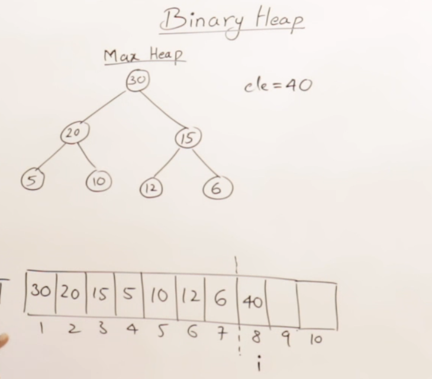
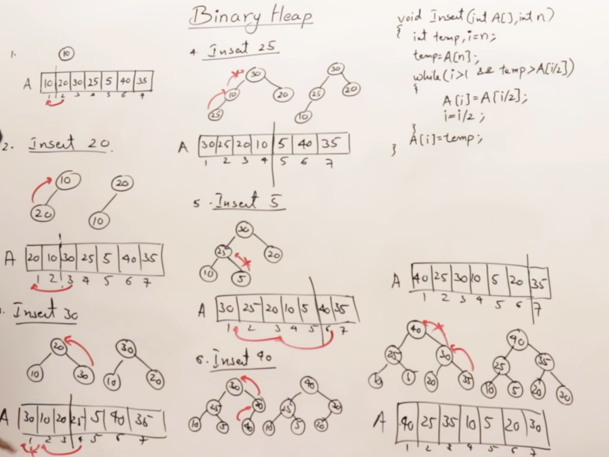

## Heap
- Elements are adjusted by sending them towards root from leaf (Insertion)
- Elements are adjusted by sending them from root towards leaf (deletion)
- Heap is a left complete binary tree and can be either min-heap or max-heap.
	- Min-Heap - Every node must have element smaller or equal to its descendents.	
		- Smallest value in the tree present at root
	- Max-Heap - Every node must have element greater than or equal to its descendents.
		- Largest value is present at root
			- Parent Index : [ i / 2 ]
			- Left Child Index : [ i * 2 ]
			- Right Child Index : [ i * 2 + 1]
				- where i is the index of the desired node
				- **Height of complete binary tree is always logn so that of the heap**
## Insertion
- ### Idea
	- **Insert element in the next complete binary tree order and compare with the parent / ancesstors to rearrange elements to form heap again.**
- Insertion in heap is done in next free space as we want to maintain complete binary tree structure.
	- 
- Rearrange the elements after inserting element in next free space to maintain heaps property.
	- Insertion is done at last and we start comparing the element with its parent till it reaches its original or suitable position in the heap
## Heap Creation
- Heap is create **inplace.**
- Make array of elements and assume first element is in heap
- Then we start inserting elements from right hand side to heap area and heapifying the elements to form heap
 

	
## Deletion in Heap
- **Only Root element can be deleted from heap**
- Last element in array is placed at root to maintain complete binary tree structure
	- Now compare the child of the new root and select the largest or smallest depending upon heap type and compare the selected element with the new root by sending it downwards.
		- if parent is smaller than the child, interchange them (max-heap)
		- if parent is greater than the child, interchange them (min-heap)
- **Deleting Max-Heap -- Elements are sorted in Ascending Order**
- **Deleting Min-Heap -- Elements are sorted in Descending Order**

## Analysis of Heap and HeapSort
- Creating heap takes O(nlogn)
- Deleting heap takes O(nlogn)
- Heap Sort takes 2nlogn -> O(nlogn)

## Heapify
- Same thing like arranging elements in deleting heap