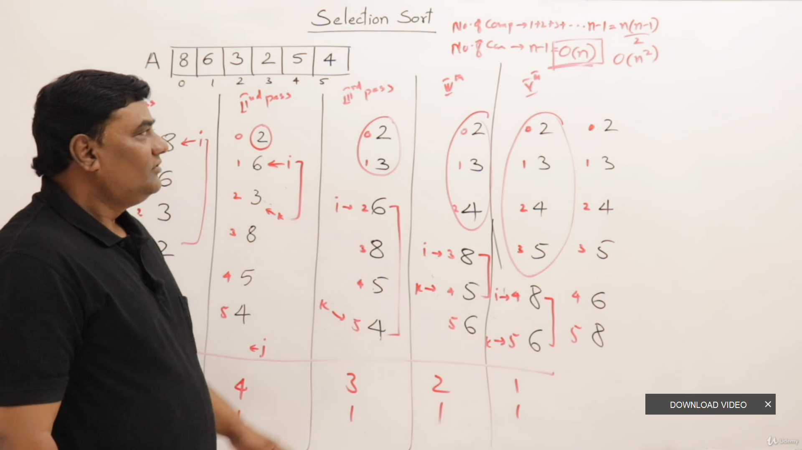

## Selection Sort
- Comparison based sort having O(n^2) complexity(comparisons) and performs n-1 swaps.

- **In selection sort, we select a position and find element for that position**
	- Class Scenario
		- I selected the Forwardmost seat and seeing who should sit on that seat
- **Intermediate Results**
	- If we perform 1 pass of selection sort, we'll get 1 element sorted
		- If k num of passes are performed we get k elements sorted - k smallest elements.
	  - Only algorithm with minimum number of swaps.
	  - **Not adaptive and stable**

