# Project Directory Structure
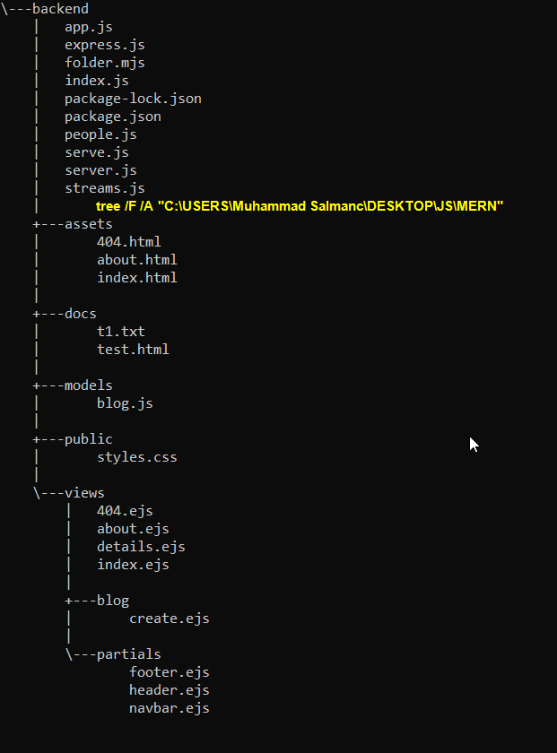
<br>
# Creating Nodejs Project

To create a Node.js project, you can follow these steps:

1.  Open your terminal or command prompt.
2.  Navigate to the directory where you want to create your project.
3.  **Run `npm init` command to initialize a new Node.js project.**
4.  This command will prompt you to provide information about your project, such as the project name, version, description, entry point, etc. You can either press enter to accept the default values or provide your own.
5.  After providing the required information, it will generate a `package.json` file in your project directory, which contains metadata about your project and its dependencies.
# Global Object

# Module vs Require

- In Node.js, you can modularize your code by splitting it into different modules. Each module encapsulates a set of related functions and variables.

- To use functions and variables defined in one module in another module, you need to use the `require` function. It allows you to import other modules into your current module.
  - For example, suppose you have a module named myModule.js that exports a function called greet

	```js
	// People.js
	const items = ["Cake", "Pie", "Jelly Beans", "Noughat"];
	const price = [2300, 340, 560, 400, 200];
	const bakeryItems = { items, price };
	// console.log(items)
	// module.exports = { items, price };
	exports.sth = { items };

	// Index.js

	const bakers = require("./people");
	console.log(bakers); // outputs the items array

	// Another example myModule.js
	exports.greet = function () {
	  console.log("Hello, world!");
	};
	```

# Working with Filesystem📂🗃🗄
- Nodejs provides library/module `fs` for working with filesystem easily

### Reading file
- File can be read easily using `readFile()` in `fs` library. It's an asynchronous function and required two parameters filepath and a callback function containing again two parameters of err and data as explained with the help of code
```js
	// Read.js
	const fs = require('fs');
	fs.readFile('./docs/blog1.txt', (err, data) => {
	  if (err) {
		console.log(`Unable to read file: ${err}`);
		throw err;
	  }
	  console.log(data.toString());
	});
```

### Writing file
- Writing to a file is same as reading with an exception, it have extra param of data that's to be written
```js
	// Write.js
	const fs = require('fs');
	const dataToWrite = 'This has to be written to the file';
	fs.writeFile('./docs/newFile', dataToWrite, (err)=>{
		if(err) {
			console.log(`Unable to write file : ${err}`);
			throw err;
		}
		console.log('Data was written to file...')
	});
```

### Working with Directories
```js
	// Folder.mjs
	// .mjs => module js

	import { existsSync, mkdir, rmdir } from "fs";

	// creating directory
	if (!existsSync("./testDir")) {
	  mkdir("./testDir", (err) => {
		if (err) throw err;
	  });
	  console.log("creating directory...");
	} else {
	  console.log("Directory already exists. Deleting Directory");

	  // removing directory
	  rmdir("./testDir", (err) => {
		if (err) {
		  console.log(`Unable to remove the directory : ${err}`);
		}
	  });
	}

```


## Buffers and Streams
- Buffers and streams are essential concepts in Node.js for handling data efficiently. They are particularly useful when working with **large amounts of data.**

### Read Streams
- Read streams allow to read data from a source in a chunk-by-chunk manner. Here's an example that reads data from a file using a read stream:
```js
	const fs = require("fs");

	// utf-8 is encoding optional parameter. If not passed, have 
	// to use toString() on the data

	const readStream = fs.createReadStream("longFileToRead", "utf-8");
	readStream.on("data", (chunk) => {
	  console.log(chunk);
	});

	readStream.on('end', ()=>{
		console.log('File has been read completely using streams');
	});

```
### Write Streams
- Write streams allow you to write data to a destination in a chunk-by-chunk manner. Here's an example that writes data to a file using a write stream
```js
	const fs = require('fs');
	const writeStream = fs.createWriteStream("/path/to/file.txt");
	writeStream.write('Hello this is long string of data');
	writeStream.write('Again writing long streams of data');

	// Have to end the stream to safely write/save data to file
	writeStream.end();

	writeStream.on('finish', () => {
	  console.log('Writing complete.');
	});
```

### Piping
- Piping is a technique in Node.js that allows you to connect the output of one stream to the input of another stream. It provides a concise way to read from a source and write to a destination. Here's an example that demonstrates piping:
```js
	const fs = require('fs');

	const readStream = fs.createReadStream('input.txt', 'utf8');
	const writeStream = fs.createWriteStream('output.txt');

	readStream.pipe(writeStream);

```
- This code reads data from the `input.txt` file using a read stream and writes it to the `output.txt` file using a write stream. The `pipe()` method connects the two streams, automatically handling the flow of data between them.
# Request and Responses🧾📞
- When building web applications with Node.js, you often need to handle HTTP requests and send appropriate responses. Unlike languages like php, which have its own webserver like apache, we've to code for our server to be up, running and listening to the client requests. Here are some key concepts related to handling requests and responses:

## Creating an HTTP Server
- When creating an HTTP server in Node.js, the callback function inside the `createServer()` method will be executed every time a request is made to the server. This callback function is commonly referred to as the **request handler or request listener**.

- Inside the request handler, you can place your business logic to handle the site routing or perform any necessary operations based on the received request.

- The `req` object (short for request) passed as the first argument to the callback function contains valuable information about the incoming request. It **stores details such as the URL, request method (GET, POST, etc.), headers, query parameters, and more**.

Here's an example code snippet illustrating the creation of an HTTP server and the basic usage of the `req` object:
```js
	const http = require("http");
	const server = http.createServer((req, res) => {
	  console.log("A request to the server was made.");
	  console.log("Request URL:", req.url);
	  console.log("Request Method:", req.method);
	  console.log("Request Headers:", req.headers);
	  // Handle routing and perform other operations 
		// based on the request
	});

	server.listen(3000, "localhost", () => {
	  console.log("Listening for requests on port 3000");
	});
```

## Serving Pages & Basic Routing
- For serving pages to user, we've to use `fs` and `http` modules together 
- We can use either `readFile()` or `createReadStream()` to read from file and then in the same block, write those data chunks to response.
	- `readStreams()` are preferred as they allow for reading large files efficiently
		- We can use their `on Events` to code on certain event handlers such as `on('data')`, `on('error')`, `on('end')` etc
	- Have to tell the browser about the possible response type whether its of json format, text/plain or text/html using `setHeader()`
```js
	const http = require("http");
	const fs = require("fs");

	const server = http.createServer((req, res) => {
	console.log("request was made");
	res.setHeader("Content-Type", "text/html");

	  // read file
	let relativePath = "./assets/";
	console.log("Asked url", req.url);
	if (req.url === "/") relativePath += "index.html";
	else if (req.url === "/about") relativePath += "about.html";
	else relativePath += "404.html";
	console.log(
		`File ${relativePath} exists? ==>> ${fs.existsSync(relativePath)}`
	  );

	const readStream = fs.createReadStream(relativePath, "utf-8");
	readStream.on("data", (chunk) => {
		res.write(chunk);
		console.log("reading file");
	});
	readStream.on("end", () => {
		res.end();
		console.log("File has been completly read");
	});

	readStream.on("error", () => {
		console.log("An error is preventing from writing to the response");
		console.log(
		  `This is the file path I've been asked to open ${relativePath}`
		);
	});
	});

	server.listen(3000, () => {
	  console.log("listening on port 3000");
	});

	
```

- **Optimized version** - Using piping🧐
	- **resp.end() will stop hanging the browser** 

```js
	const http = require("http");
	const fs = require("fs");

	const server = http.createServer((req, res) => {
	  console.log("request was made");
	  res.setHeader("Content-Type", "text/html");

	  // read file
	  let filePath = "./assets/";
	  console.log("Asked url", req.url);
	  if (req.url === "/") filePath += "index.html";
	  else if (
		req.url === "/about.html" ||
		req.url === "/about" ||
		req.url === "about.html"
	  )
		filePath += "about.html";
	  else filePath += "404.html";
	  console.log(`File ${filePath} exists? ==>> ${fs.existsSync(filePath)}`);

	  if (fs.existsSync(filePath)) {
		const readStream = fs.createReadStream(filePath, "utf-8");
		readStream.pipe(res);
		console.log("Reading file and sending response");
	  } else {
		console.log("File not found");
		res.statusCode = 404;
		res.writeHead(404, { Location: "/.assets/404.html" });
		res.end("404 Not Found");
	  }
	});

	server.listen(3000, () => {
	  console.log("listening on port 3000");
	});

```


## Status Codes🗿
- Status code describes the type of response sent to the browser
	- 200 - OK
	- 301 - Resource Moved - Permanent Redirect
	- 404 - Not found
	- 500 - Internal Server Error
- To set the status code of a response is by using `stausCode` property of the response object
	- `res.statusCode = 200`

## Redirects
- Redirects are commonly used for handling URL changes, implementing URL shorteners, or directing users to the appropriate pages based on certain patterns or conditions.
- We can also use regex for website redirection
- Also `res.header()` to redirect to the working conditon
- Also `res.writeHead(status_code, {Location: 'NewLocation'})`

# NPM - Node Package Manager
- NPM (Node Package Manager) is a command-line tool and package manager that comes bundled with Node.js. It allows you to easily install, manage, and share JavaScript packages and libraries.
- **Package Installation**
	- **Globally**
		- NPM allows you to install packages globally, which means they are available to all Node.js projects on your system. Global packages are typically command-line tools or utilities. You can install a package globally using the following command:
		`npm install -g package-name`
	- **Project Specific Packages**
		- In addition to global installations, NPM is commonly used to manage project-specific dependencies. These dependencies are listed in a `package.json` file, which serves as a manifest for your project. It includes information about your project and its dependencies.
- **package.json**
	- `npm init` command will guide you through a series of prompts to set up the initial configuration for your project. Alternatively, you can use `npm init -y` to skip the prompts and generate a default `package.json` file.
	- **Basic Structure**
		-  A `package.json` file follows a JSON (JavaScript Object Notation) structure and consists of various fields. Some of the important fields include:
			- `name`: Specifies the name of your project.
			- `version`: Represents the version number of your project.
			- `description`: Provides a brief description of your project.
			- `author`: Indicates the author(s) of the project.
			- `license`: Specifies the license under which your project is distributed.

- **Dependencies**
	- One of the key features of the `package.json` file is managing project dependencies. It allows you to list the packages and libraries required for your project to run correctly. Dependencies can be categorized into two types: `dependencies` and `devDependencies`.
	 	- `dependencies`: These are the packages required for your project's production environment.
		- `devDependencies`: These are the packages required for development and testing purposes.

	- Dependencies are specified as key-value pairs in the `dependencies` and `devDependencies` fields, where the key is the package name and the value is the desired version or version range.

- **Scripts**

	- The `scripts` field in the `package.json` file allows you to define custom scripts that can be executed using the `npm run` command. It enables you to automate various tasks and define shortcuts for commonly used commands. For example:

		```json
			"scripts": {
			  "start": "node index.js",
			  "test": "mocha tests"
			}
		```
- **Managing Dependencies**
	- NPM provides commands to install, update, and remove dependencies in your project.

		- 	To install project dependencies defined in `package.json`, you can run:
			- `npm install`
			- This command reads the `package.json` file and installs all the listed dependencies.
		- `npm install package-name`
			- To install a specific package as a development dependency (only required during development), you can add the `-d` flag:
			- `npm install package-name --save-dev`
- **Useful NPM Commands**
	- NPM provides various commands to manage your project and its dependencies. Here are some commonly used commands:

		- `npm install`: Installs all project dependencies listed in `package.json`.
		- `npm install package-name`: Installs a specific package and adds it as a dependency.
			- with `-g` flag, packages are installed globally
		- `npm install package-name --save-dev`: Installs a package as a development dependency.
		- `npm update package-name`: Updates a specific package to the latest version.
		- `npm uninstall package-name`: Removes a package as a dependency for the project.
			- `-g` flag uninstalls the dependency globally
		- The `npm prune` command is used to remove extraneous packages from your local project. Extraneous packages are those that are installed locally but are not listed as dependencies in your `package.json` file.

			- Running `npm prune` will remove these extraneous packages from your project, ensuring that your dependencies are in sync with what is specified in `package.json`.
			- To run `npm prune`, use the following command:
				- `npm prune`
			- This command will clean up your project by removing any unnecessary packages that are not listed as dependencies.
		- `npm run script-name`: Executes a custom script defined in the `scripts` section of `package.json`.
		- `npm search package-name`: Searches the NPM registry for packages.
		- `npm init`: Initializes a new Node.js project and creates a `package.json` file.
		- `npm publish`: Publishes your package to the NPM registry if you are developing and sharing your own package.

# Express Apps🚄
- Express is a framework that handles routing, requests, business logic, responses in much more elegant way. 
	- Makes our code easier to read, maintain and extend
	- Install express using this command
		- `npm install express`
### Express App listening to GET request on port 3000
```js
	const express = require("express");
	// const fs = require("fs");

	const app = express();
	// also returns an instance of http server and listen 
	// on port 3000
	app.listen(3000);

	// responding to requests for get request
	app.get("/", (req, resp) => {
	  // resp.send() performs the functionality of resp.write()
		// and resp.end(). resp.send() infers the content and 
		// set the content-headers automaticaly
	    // also sets the status code for most of the time
	 // Instead of opening stream and then piping, we can
	// use resp.sendFile()
	  // resp.sendFile() needs absolute path and '__dirname' 
	 // gives the current directory path
	  // and the relative path is passed as first argument
		  //   readStream.pipe(resp);
		  //   resp.send("<p>Welcome Salman Ninja...!</p>");
	  console.log(__dirname);
	  resp.sendFile("./assets/index.html", { root: __dirname });
	});

	app.get("/about", (req, resp) => {
  	resp.sendFile("./assets/about.html", { root: __dirname });
	});
	
	// redirections supports patterns
	app.get("/about*", (req, resp) => {
  	resp.redirect("/about");
	});

	// use function is called for every request
	app.use((req, res) => {
  	res.status(404).sendFile("./assets/404.html",
							 { root:__dirname});
	});
````
## Redirects & 404s
- Express follows a **top-to-bottom** approach when processing requests and handling routing. When a request is received, Express sequentially checks the registered routes from top to bottom to find a matching route for the request.
- Once a matching route is found, Express triggers the corresponding route handler function associated with that route. 
- **Once a matching route is found and its handler function is executed, Express stops checking the remaining routes defined after that matched route. This means that if multiple routes could potentially match the same request, only the first matching route will be executed, and the subsequent routes will be ignored.**
```js
	// route handler for index.html
	app.get('/', (req, res)=>{
		res.sendFile('./assets/index.html', {root: __dirname});
	})

	// route handler for about.html
	app.get('/about', (req, res)=>{
		res.sendFile('./assets/about.html', {root: __dirname})
	})

	// redirection to router handlers
	app.get('/about*', (req, res)=>{
		res.redirect('/about');
	})
```
- The `use()` function in Express is a middleware function that is executed for every request, regardless of the request method or URL
	- Such as we can have a 404 route handler request at the bottom most line, idea is that express would have executed the entire request handlers and none of them would have matched then this `use()` will be executed for certain containing code to redirect the user to 404 page
		```js
		// Define your other routes and handlers here
			// 404 route handler
			app.use((req, res) => {
				res.status(404).sendFile('./assets/404.html', 
										 { root: __dirname }
			);
		``` 
		- **By placing this 404 route handler at the bottom of your Express application, it ensures that if none of the previous routes match the incoming request, this handler will be triggered and the client will receive a "404 Not Found" response.**
# View Engines🤿💯
- View engines are modules or libraries that enable the dynamic rendering of HTML templates in Node.js web applications. They allow us to combine HTML markup with embedded code to generate dynamic content based on data or business logic.
	- **EJS, PUG, Express Handlebars** are some of the famous view engines available
## EJS View Engine - Embedded JavaScript
### EJS Basics
- **EJS (Embedded JavaScript)** is a popular templating language for Node.js applications. It allows you to generate dynamic HTML content by embedding JavaScript code directly within your HTML templates.
- Here are some basics of using EJS:
	- **Installation**: Install EJS using npm by running the following command: 
		- `npm install ejs`
	- **Setting up EJS** in your Express application:
		 ```js
			const express = require('express');
			const app = express();

			// Set EJS as the view engine
			app.set('view engine', 'ejs');
			// Set EJS default directory to look for templates
			app.set('views', path.join(__dirname, 'assets'));

		 ```
	- **Rendering EJS templates**
		- Create an EJS template file with the `.ejs` extension. For example, `index.ejs`.
		- Render the template using `res.render()` in your route handler:
			```js
				app.get('/', (req, res) => {
				  res.render('index', { title: 'My Website' });
				});
			```
		 	- The first argument to `res.render()` is the name of the EJS file to render (without the extension). The second argument is an object containing data that can be passed to the template. In this example, we're passing a title variable with the value 'My Website'.
	- **Embedding JavaScript code in EJS templates**
		- Use `<% %>` tags to **execute JavaScript code** within the template.
		- Use` <%= %>` tags to **output the result of an expression** within the template.
			For example, to display the value of the title variable passed from the route handler:
					`<h1><%= title %></h1>`
		- **Including Partial Templates / Reusable**			
			- EJS allows you to include reusable partials or components within your templates.
			- Create a separate EJS file for the partial, such as `navbar.ejs`.
			- Use the `<%- include('partial-name') %>` syntax to include the partial within another template.
				- For example, to include the `navbar.ejs` partial in your `index.ejs` template:
					- `<%- include('navbar') %>`
	- **Block of Code**
```js
		const express = require('express');
		const path = require('path');
		const app = express()
			
		// after invoking the express(), we shoulsud tell express
		// which view engine to use
		app.set('view engine', 'ejs');
		app.set('views', path.join(__dirname, 'assets'));
			
		// our views file should now be of .ejs extension
		// now we'll be using res.render() instead of
		// res.sendFile() and there we've to pass the 
		// absolute path of the file which is kind of messy
		
		app.get('/', (req, res)=>{
			res.render('index', {data object for index.ejs});
		});

		app.get('/about', (req, res)=>{
			res.render('about', {title: "About us"});
		});
	
		app.use((req, res)=>{
			res.status(404).render('404', {title: "404"});
		})
```

## EJS Templates
- EJS templates are processed through the EJS template engine on the server
- Spits valid html after processing the loops, conditions and anything thing that may lead to dynamicity ===>>> Server Side Rendering
### Route and Passing blogs to index.ejs
```js

app.get("/", (req, res) => {
  // Random blogs from internet tailored for beginners in MERN
  const blogs = [
    {
      title: "Introduction to the MERN Stack",
      snippet: "Discover the basics of the MERN stack and its components.",
      content:
        "The MERN stack is a popular JavaScript stack used for building web applications. It consists of four key components: MongoDB, Express.js, React, and Node.js.\n\nMongoDB is a NoSQL database that stores data in a flexible, JSON-like format.
    },
    {
      title: "Getting Started with MongoDB and Mongoose",
      snippet:
        "Learn how to work with MongoDB using Mongoose.",
      content:
        "MongoDB is a popular choice for databases in MERN stack development. To interact with MongoDB in a Node.js application, you can use an Object Data Modeling (ODM) library called Mongoose.\n\nMongoose provides a convenient way to define schemas, create models, and perform database operations in a structured manner."
    },
    {
      title: "Building Web APIs with Express.js",
      snippet:
        "Learn how to create RESTful APIs using Express.js in the MERN stack.",
      content:
        "Express.js is a lightweight and flexible web application framework that simplifies the process of building APIs in the MERN stack. It provides a set of HTTP utility methods and middleware to handle requests and responses."
    },
    {
      title: "Building Interactive UIs with React",
      snippet:
        "Discover how to create interactive user interfaces.",
      content:
        "React is a powerful JavaScript library for building user interfaces, and it plays a central role in the MERN stack. With React, you can create interactive and reusable UI components that efficiently manage the application's state."
    },
    {
      title: "Building Server Applications with Node.js",
      snippet:
        "Learn how to build server applications using Node.js",
      content:
        "Node.js is a JavaScript runtime that allows you to run JavaScript code on the server-side, making it a fundamental component of the MERN stack.",
    },
  ];
  res.render("index", { title: "HomePage", blogs });
});


```

### Using EJS Templates to Print Passed Data
```js
		<h2>All MERN Blogs</h2>
		<% if (blogs.length > 0) {
		  blogs.forEach(blog => { 
			console.log('Printing blogs')%>
			<h3><%= blog.title %></h3>
			<p><%= blog.snippet %></p>
			<p><%= blog.content %></p>
		  <% });
		}else %>
```

### Some Screenshots 🧐
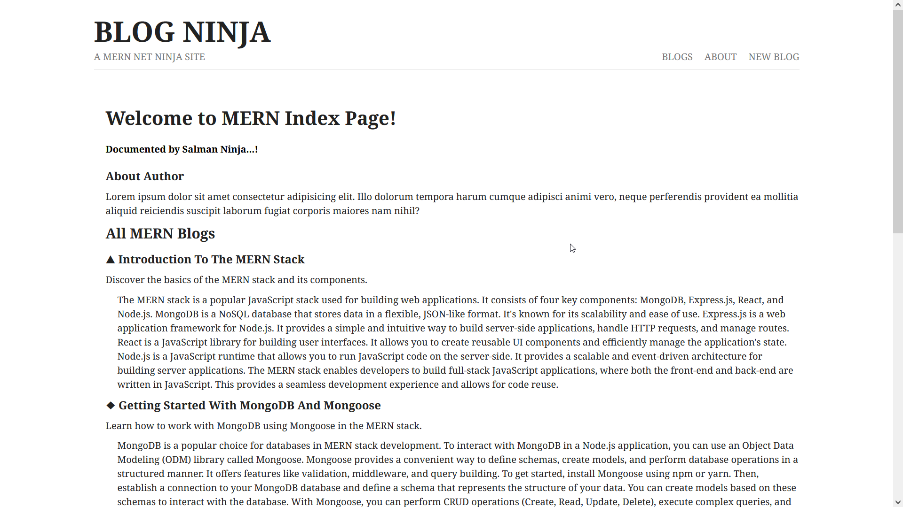

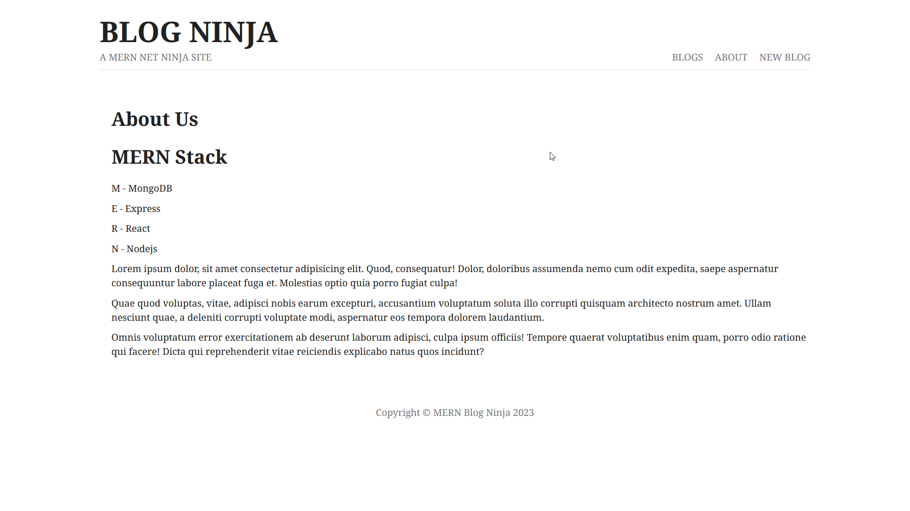

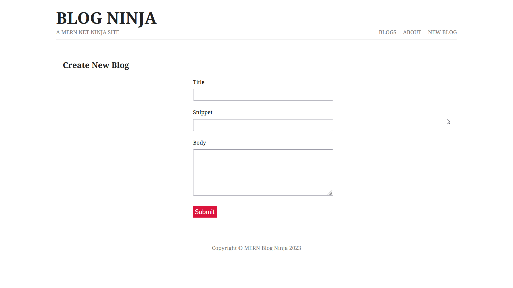

## Middleware and Static Files
- Code that runs on the server between getting a request and sending a response
- Express uses the `use()` method to add middleware functions to the application's request handling pipeline.
- Static files, such as HTML, CSS, images, and JavaScript files, can be served using the `static middleware` in Express.
	- **Examples / Typical Usage of Middleware**
		- Return 404 pages
		- Logger middleware to log details of every request
		- Authentication check middleware for protected routes
		- Middleware to parse JSON data from requests
### use() and next()
- The **`use()`** method in Express is used to add middleware functions.
- Middleware functions take three arguments: **request, response, and next**.
 - `next()` is a function that passes conctrol to the next middleware function in the pipeline.
 -  **If `next()` is not called, the request will not proceed to the next middleware or route handler.**
### 3rd Party Middleware
- Third-party middleware packages enhance the functionality of Express applications.
- **Morgan** is a popular logging middleware that provides information about HTTP requests.
- **Morgan** logs details such as the HTTP method, status code, response time, and more.
### Static Files
- Express uses the **static middleware** to serve static files.
- The static middleware serves files from a specified directory.
- **The served static files can be accessed directly by their URLs.**
- **Static files will be accessible from the root path of our website**
	- Let say we've `styles.css` in our public directory which is static then its accessible via the root path of our website, e.g.
		- `localhost:3000/styles.css`
- Predefined Formats
    - `'combined'`: Standard Apache combined log format.
    - `'common'`: Standard Apache common log format.
    - `'dev'`: Concise output for development purposes.
    - `'short'`: Shorter output format.
    - `'tiny'`: Minimal output format.
### Middleware Practice Code
```js
	const express = require("express");
	const path = require("path");
	const morgan = require("morgan");

	const app = express();

	// Register view engine
	app.set("view engine", "ejs");
	// path.join is compatible with diff. OS, 
	// whereas string concatentation is'nt
	// Absolute path to the views directory
	// app.set("views", path.join(__dirtitle, "assets")); 

	// Your route handlers go here...

	// Start the server
	app.listen(3000, () => {
	  console.log("Server is running on port 3000");
	});

	// serving the public folder
	app.use(express.static("./public"));

	app.use((req, res, next) => {
	  console.log("Method : ", req.method);
	  console.log("Request / Path Asked: ", req.path);
	  console.log("Host : ", req.hostname);
	  next();
	});

	app.use(morgan("combined"));

	// Remaining route handlers


```

# NoSQL / Mongo DB (Mongoose)🧐
<center>

| Database Type | Structure      | Terminology       |
| ------------- | -------------- | ----------------- |
| SQL           | Tables         | Rows, Columns     |
| NoSQL         | Collections    | Documents - JSON-like objects|

</center>

## Collections analogous to Tables in SQL &
- Collections represent a grouping of related documents, similar to how tables represent a grouping of related rows in SQL databases, e.g. user collection or blog collection.
- Documents in a collection can have varying structures and fields based on the data they represent.
- Documents refer to single record of data.
	- There can be multiple documents inside a single collection
		- Documents in blog collection may contain data consisting of id, title, snippet and contents in JSON format (A series of key-value pairs)
		- Example document in the blog collection:
			```json
					{
						"_id": Objectid(12345),
						"title": "Becoming MERN Ninja",
						"snippet": "all about the...",
						"content": "blah blah blah..."
					}
			```
			
		- Ids are autogenerated and are unique	
		- A blog document represents a single blog entry.
## MongoDB Setup and Atlas
- We can either use MongoDB locally or use it in cloud using a service known as MongoDB Atlas.
- Login to your [MongoDB Account](https://account.mongodb.com/account/login)
	- Create a project if you haven't one already setup.
		- My project name is **mern**
	- Create a free cluster under this project
		- My cluster name is **MERN**
	- Then we need to create a database and a collection inside that database
		- On cluster page (in my case MERN), click on `Browse Collections` 
			- And then add your own data by clicking on `Add My Own Data`
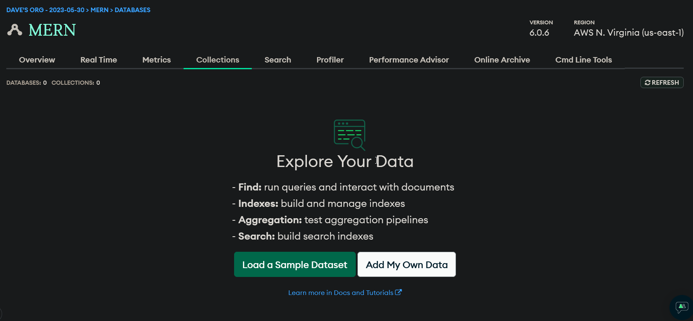
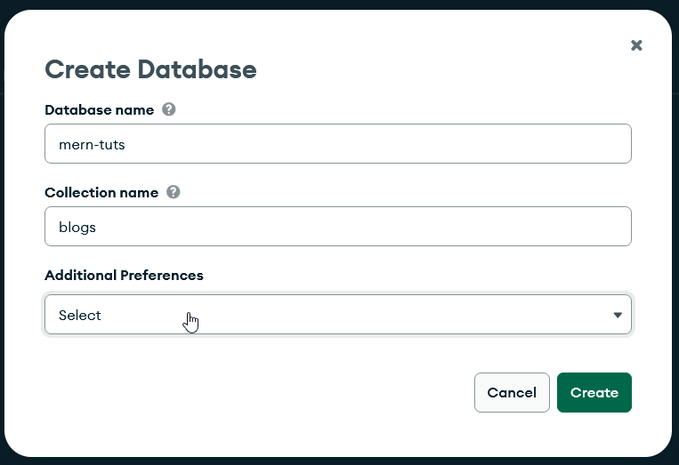
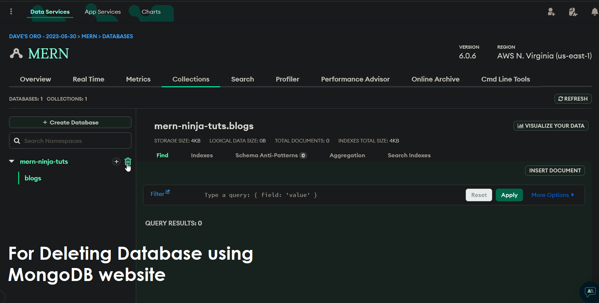
### Add users to Database
- You should already have an authorized user setup to access database access securely
- See for **Database Access** in the left bar
- Create a user if not done already so that only valid users could connect to the database
### Connecting to Database
- Go to cluster page again and hit connect button 
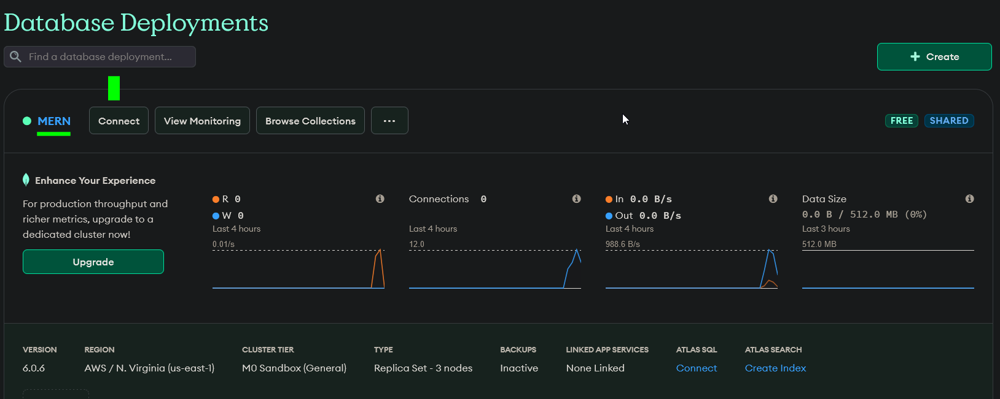
## Mongoose
- Mongoose is an ODM library - Object Document Mapping Library
	- Wraps the standalone mongodb library or drivers and do the heavy lifting for us
- Mongoose uses Schema to achieve this purpose
### Establish Connection
```js
	// assign our database instance
	var uri = 'mongodb://localhost/dbName';
		mongoose
		  .connect(uri)
		  .then((result) => {
			console.log(`connected to database`);
			// Start the server only when connected to database
			app.listen(3000, () => {
			  console.log("Server is running on port 3000");
			});
		  })
		  .catch((err) => {
			console.log(err);
		  });
```
### How to use Mongoose?
### Schemas & Models
- ***Schemas define the structure of a type of data / document***
	- *Properties & Property Types*
		- User Schema:
			- name(String), required
			- age(number)
			- bio(String), required
		- Blog Schema:
			- title(String), required
			- snippet(String), required
			- content(String), required
- **Models allow us to communicate with the database collection**
	- Blog Models then have both static and instance methods which can we use to perform CRUD operations from a blog collections
	```mermaid
	graph LR
	  A[Blog Schema] --> B[Blog Model]
	  B --> C[Blog Document]
	  C --> D[Blogs Collection]
	```
- In summary, a **Schema** defines the structure and validation rules for documents, a **Model** provides an interface to perform database operations on a specific collection based on the defined Schema, and a **Document** represents a single record within that collection.
```js
	var mongoose = require('mongoose');
	var Schema = mongoose.Schema;
	var BlogSchema = new Schema({
		title: String,
		snippet: String,
		content: String,
		author: String,
		published: false
	});
	module.exports = monogoose.model('Blog', BlogSchema);
```
- ***Another way of Creating Schema 🎨***
```js
	var mongoose = require("mongoose");
	var Schema = mongoose.Schema; //Schema => constructor function
	var blogSchema = new Schema(
  	{
   	 title: {
   	   type: String,
   	   required: true,
   	 },
   	 snippet: {
   	   type: String,
   	   required: true,
   	 },
   	 content: {
  	    type: String,
   	   required: true,
   	 },
  	},
  // The timestamps option tells mongoose to assign createdAt and
	// updatedAt fields to your schema. The type assigned is Date.
  	{ timestamps: true } 
	);
	module.exports = mongoose.model("Blog", blogSchema);
```
- **📛Important Notice**
	- When you create a model using `mongoose.model('Blog', schema)`, Mongoose uses the provided name ('Blog') to **determine the name of the corresponding collection in the MongoDB database**. 
		- By default, **Mongoose pluralizes the name and converts it to lowercase to create the collection name.** So, in this case, the collection name in MongoDB would be 'blogs'.
### Performing CRUD Operations
#### Saving a single Object
```js
	app.get('/new-blog', (req, res)=>{
		const blog = new Blog({
			title: "My Fresh New Blog",
			snippet: "Today My blog is about....",
			content: "My blog content is..."
		});
		blog.save()
			.then((result) => res.send(result))
			.catch(err) => console.log(err);
	})
```
#### Storing Array of Objects
```js
	// Route for adding multiple blogs
	app.get("/new-blogs", (req, res) => {
	  const blogs = [
		{
		  title: "Introduction to the MERN Stack",
		  snippet: "Discover the basics of the MERN stack",
		  content: "Lorem ipsum dolor sit amet, consectetur...",
		},
		{
		  title: "Getting Started with MongoDB and Mongoose",
		  snippet: "Learn how to work with MongoDB using Mongoose",
		  content: "Lorem ipsum dolor sit adipiscing elit...",
		},
		// Add more blog objects to the array...
	  ];

	  Blog.create(blogs)
		.then((result) => {
		  res.send(`Blogs added to the database: ${result}`);
		})
		.catch((err) => {
		  console.log(err);
		  res.send("Error saving the blogs to the database");
		});
	});

```

#### Fetching Data
```js
	app.get("/", (req, res) => {
	  Blog.find()
		.then((blogs) => {
		  res.render("index", { title: "HomePage", blogs });
		})
		.catch((err) => {
		  console.log(err);
		  res.send("Error fetching blogs from the database");
		});
	});	

```

### Some Useful Mongoose Methods
- `Blog.findById()`: This method is used to fetch a single document from the collection based on the provided document ID. It returns a promise that resolves to the matched document or `null` if no document is found. For example:
 ```js
	  const blogId = '123456789'; // Dummy document ID
	  Blog.findById(blogId)
		.then((blog) => {
		  // Handle fetched blog
		})
		.catch((error) => {
		  // Handle error
		});
```

- `Blog.create()`: This method is used to save one or multiple documents (objects) to the database. It accepts an object or an array of objects as input and creates new documents in the corresponding collection based on the defined schema. For example:
 ```js
	  Blog.create(blogData)
		.then((result) => {
		  // Handle successful creation
		})
		.catch((error) => {
		  // Handle error
		});
```

- `blog.save()` method is used to save a modified or newly created document to the database. It is called on an instance of the Blog model (a document) and returns a promise that resolves to the saved document. For example:
 ```js
	  const blog = new Blog({ title: 'My Blog', content: 'Lorem ipsum dolor sit amet' });
	  blog.save()
		.then((savedBlog) => {
		  // Handle saved blog
		})
		.catch((error) => {
		  // Handle error
		});
```

- `Blog.find()`: This method is used to fetch all documents from the collection associated with the `Blog` model. It returns a promise that resolves to an array of documents. For example:
 ```js
	  Blog.find()
		.then((blogs) => {
		  // Handle fetched blogs
		})
		.catch((error) => {
		  // Handle error
		});
```
- `blog.sort()`: In Mongoose and MongoDB, the sort() method is used to specify the sorting order for query results. 
	-   -1 for descending and 1 for ascending
```js
		// Sort by the "createdAt" field in descending order
	Blog.find()
	  .sort({ createdAt: -1 }) 
	  .then((blogs) => {
		res.render("index", { title: "HomePage", blogs });
	  })
	  .catch((err) => {
		console.log(err);
		res.send("Error fetching blogs from the database");
	  });

```

# Get, Post and Delete Requests
## Request Types
- GET requests to **get a resource**
	- We can use **same route for different types of requests**
- POST requests to **create new data**(e.g. a new blog, or form data submission)
- DELETE requests to **delete a data**(e.g. deleting a blog)
- PUT requests to **update data**(e.g. updating the blog)

## Route Structure of Simple CRUD Application
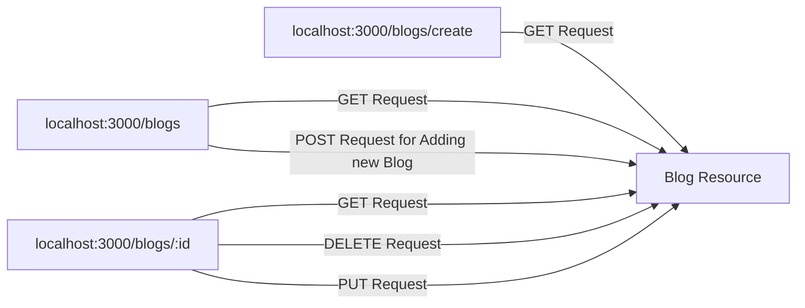

## POST Requests
- We can use **Fetch API or HTML Forms** to send us POST requests
	- Using forms, we've to set the name attributes for our input fields
		- Then set the action to the route where we want to handle that POST request
			- Then we would want to set form method to POST
- In the route handler file, we've to use a express middleware which is urlencoded()
	- `app.use(express.urlencoded({extended: true}))`
		- used for accepting forms data
		- extended argument is optional
	- When we've added the middleware function, the content of the input is encoded or stored into an object accessible via `req.body` object
- Then we've to add a new request handler for the same route(depends on  case/scenario)
	```js 
		app.post('/blogs', (req, res) =>{
			const blog = new Blog(req.body);
			blog.save()
				.then(res.redirect('/'))
				.catch((err) => console.log(err))
		})
	```
	
## GET Requests (localhost:3000/blogs/:id)
### Route Parameters
- Variable parts of the route that may change
	- `localhost:3000/blogs/:id"`
		- `id` here is an route parameter
			- `localhost:3000/blogs/12345"`
			- `localhost:3000/blogs/50"`
			- `localhost:3000/blogs/hello"`
- Have to setup the ids where we're printing all the blogs
	```js
	<% if (blogs.length > 0) { %> <% blogs.forEach(blog => { %>
      <a class="single" href="/blogs/<%=blog._id %>">
        <h3 class="title">
         <%= blog.title %>
        </h3>
        <p class="snippet"><%= blog.snippet %></p>
      </a>
      <p class="content"><%= blog.content%></p>
      <% }) %> <% } else { %>
      <p>There are no blogs to show right now....</p>
    <% } %>
	````
	- This line here is setting up the links of each individual blogs
		- `<a class="single" href="/blogs/<%=blog._id %>">`
### Extracting and Handling Route Params
- In the main file where we're handling our routes, make a new route for handling single blog details page
- Extracting route parameter
	-  `const id = req.params.id`
	```js
		app.get("/blogs/:id", (req, res) => {
		  const id = req.params.id;
		  Blog.findById(id)
			.then((result) => {
			  res.render("details", { blog: result, title: "Blog Details" });
			})
			.catch((err) => console.log(err));
		});
	```
## DELETE Requests
- Make a new delete button next to the blog having data-doc set to the blog_id
	`<a class="delete" data-blogID="<%= blog._id %>">delete</a>`
- In the client-side script, you can attach an event listener to the delete button(s) using the addEventListener method.
	- When the delete button is clicked, a `DELETE request` is made to the server using the `Fetch API`.
		- The server's response can be processed in the `then()` method of the fetch call. You can check if the response was successful (using response.ok) and then extract the redirect property from the response JSON.
		- Once the redirect property is obtained, you can update the `window.location.href` to redirect the user to the specified page.
			- `data-blogID` is an important attribute as we've to use the same name as `blogID` while fetching value from the dataset using `deleteButton.datset.blogID`
				- `data` is a special attribute in html where we can specify our own custom attribute like in our case `blogID`
					- The data attribute follows the format of `data-*`, where `*` can be replaced with any name you choose for your custom data attribute. For example, `data-name`, `data-id`, `data-info`, etc.
					```html
						<div data-name="John Doe" data-age="25" data-info="Some additional information"></div>

					```
	```js
		<script>
			const deleteButton = document.querySelector("a.delete")	
			deleteButton.addEventListener("click", (e) => {
				const blogId = deleteButton.dataset.blogID
				const endPoint = `/blogs/${blogId}`
				fetch(endPoint, {
					method: "DELETE"
				})
					.then((response) => response.json())
					.then((data) => window.location.href = data.redirect))
					.catch((err) => console.log(err))
			})	
		</script>
	```
	- **Much more optimized version** 💀💀💀
		- Instead of directly accessing `response.json()`in the fetch `then()` method, it's good practice to check the ok property of the response to ensure the request was successful. You can then handle the response accordingly.
```js
		fetch(endPoint, {
		  method: 'DELETE',
		})
		  .then((response) => {
			if (response.ok) {
			  return response.json();
			} else {
			  throw new Error('Delete request failed');
			}
		  })
		  .then((data) => {
			window.location.href = data.redirect;
		  })
		  .catch((err) => console.log(err));
```
	
- **Server-Side Route**
	```js
		app.delete('/blogs/:id', (req, res) => {
			const blogID = req.params.id
			Blog.findByIdAndDelete(blogID)
				.then((result) => res.json({redirect : '/'}))
				.catch((err) => console.log(err))
		})
	```
	- **Much optimized and better working code**🧐
		- To handle error cases when deleting a blog, you can use the 404 Not Found HTTP status code and send an appropriate response. For example:
```js
	app.delete('/blogs/:id', (req, res) => {
	  const blogID = req.params.id;
	  Blog.findByIdAndDelete(blogID)
		.then((result) => {
		  if (result) {
			res.json({ redirect: '/' });
		  } else {
			res.status(404).json({ error: 'Blog not found' });
		  }
		})
		.catch((err) => {
		  console.log(err);
		  res.status(500).json({ error: 'Internal server error' });
		});
	});

```
- **Important to Consider**	
	- When a request is made to the server using the Fetch API, the server responds with JSON data that includes the URL to which the client should be redirected, rather than redirecting the client itself. 
		- This approach allows for more control and flexibility on the client-side. By sending the redirect URL as part of the JSON response, the client can extract this information and handle the redirection process accordingly. 
			- The client-side code can then utilize the obtained redirect URL to update the `window.location.href` property, triggering the actual redirection to the desired page.
		 		- This separation of concerns allows the client to handle the redirection logic based on the server's response, providing a more seamless user experience and enabling better management of the client's navigation flow.
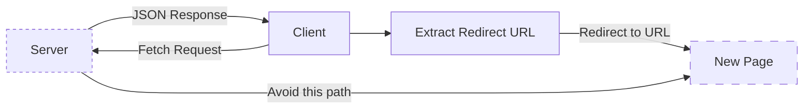

# Express Router & MVC
- In Express.js, the **Router is a middleware** that allows you to organize your application's routes into separate modules or files. 
	- It provides a way to create modular, mountable route handlers that can be used as middleware.
	- The **Router object acts as a mini express application** with its own routing system, middleware stack, and `HTTP` methods such as `get`, `post`, `put`, `delete`, etc. You can define multiple routes within a router and use it as a middleware in your main application.
		- The following example creates a router as a module, loads a middleware function in it, defines some routes, and mounts the router module on a path in the main app.
			- Create a router file named birds.js in the app directory, with the following content:
```js
		const express = require('express')
		const router = express.Router()

		// middleware that is specific to this router
		router.use((req, res, next) => {
		  console.log('Time: ', Date.now())
		  next()
		})
		// define the home page route
		router.get('/', (req, res) => {
		  res.send('Birds home page')
		})
		// define the about route
		router.get('/about', (req, res) => {
		  res.send('About birds')
		})

		module.exports = router
```
- Then, load the router module in the app:
	```js
	const birds = require('./birds')

	// ...

	app.use('/birds', birds)
	```
	- The app will now be able to handle requests to /birds and /birds/about, as well as call the timeLog middleware function that is specific to the route.
- Using the Express Router can help improve the organization and maintainability of your code, especially as your application grows and you have multiple routes to manage.

## After Refactoring or Using Express.Router()


## MVC Basics
- Stands for Model, View, Controller
- MVC is a way of structuring our code & files
- Keeps code more reusable, modular & easier to read
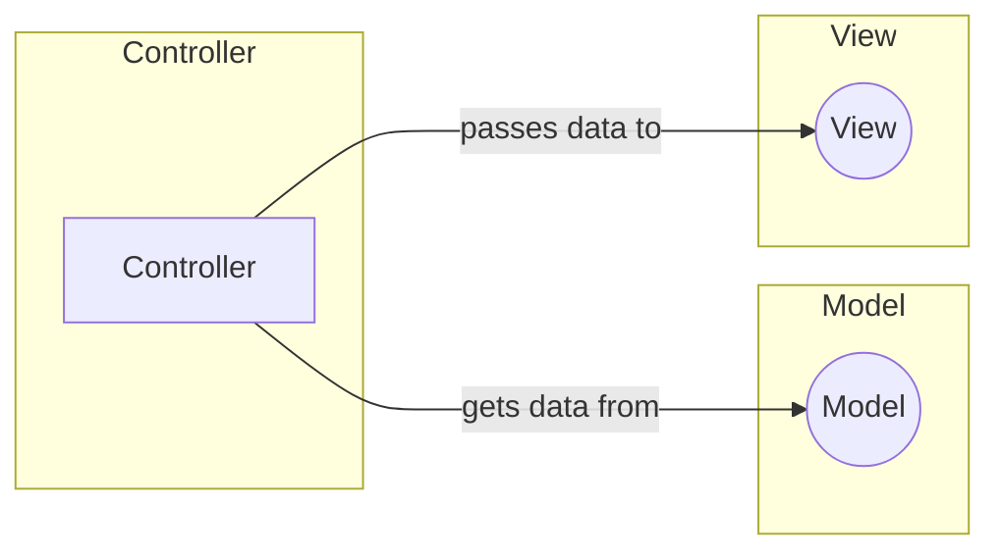
- Controller is a middleman that gets data from models and then pass that data into views.
	- The idea of controller is to extract the route functions to a seprate route file then we would reference those route functions in our route file which would make our code easier to read, manage and understand
		- We're splitting our code into different areas of file and then each area of file has its own job to do