<h1>
 

Assignment # 02

 Muhammad Salman  212370003  CS-212A  Automata Theory
 
</h1>

## \#1.
### \#1.1. Construct FA
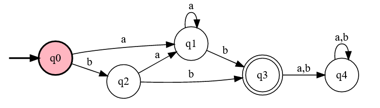

### \#1.2. Language Accepted
Given DFA accepts the langauge generated by the following regular expression,
	
<strong>R.E = a\*b+b(a*b+b)</strong>

### \#1.3. Sample Strings

| Strings 	| 
Images
  	| Result 	|
|:-------:	|---	|----------	|
| **bb**  	|  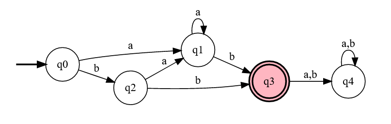 	|  Accepted        	|
| **baab**  	|   	|   Accepted       	|
| **aaab**  	|   	|   Accepted       	|
| **baaa**  	|  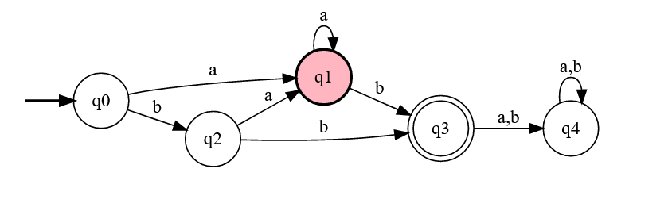 	|    Rejected      	|
| **baaaba**  	|  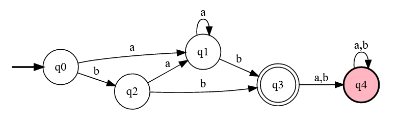 	|     Rejected     	|

----------------------------------------------------------------------------------------

                                               
## \#2.
### \#2.1. {w ε {a, b}*: every string in w begins with aa and ends with bb}.
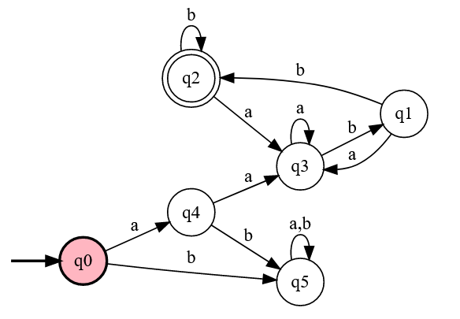

### \#2.2. {w ε {0, 1}*: every binary number is divisible by 4}.
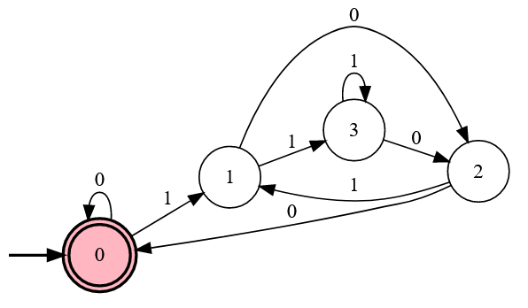

### \#2.3. {w ε {0, 1}*: every string in w contains an even number of 0’s and 1’s}.
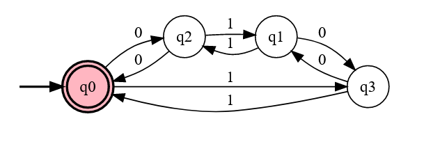

### \#2.4. {w ε {0, 1}*: every string in w has 0001 as a substring}.
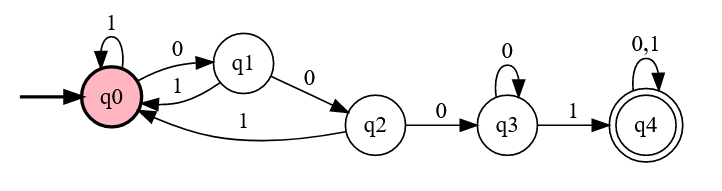

### \#2.5. {w ε {0, 1}*: every string in w does not have 0001 as a substring}.
R.E = **(^+0+1)(10+11+01)***
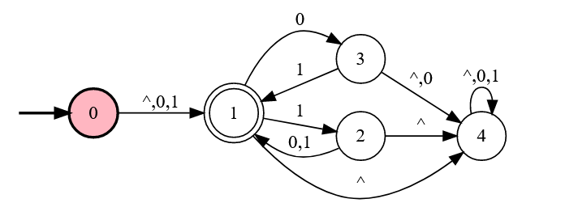
<h5>OR</h5>
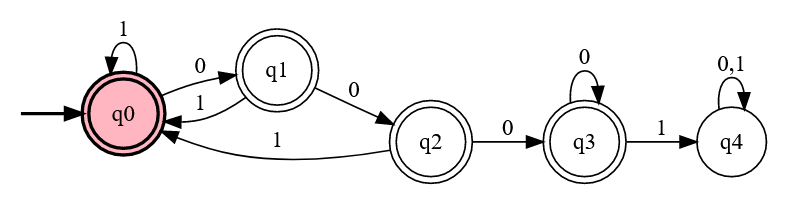

### \#2.6. {w ε {x, y}*: w has no more than one pair of consecutive x’s and no more than one pair of consecutive y’s }.
R.E = **(Y+XY)\*(XX+^)(Y+XY)\*(X+YX)\*(YY+^)(X+YX)\***

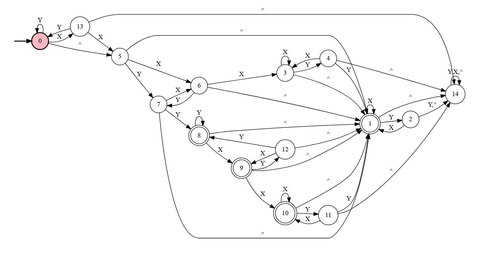

----------------------------------------------------------------------------------------

 
 

## \#3. English Description of the Accepted language
-	Given DFA accepts all those strings that ends either with aaa or bb or ba.
<!-- -	Given DFA accepts all those strings that ends either with aa or bb. -->

----------------------------------------------------------------------------------------

## \#4. 
### \#4.1. Transition Diagrams 
#### a. M1

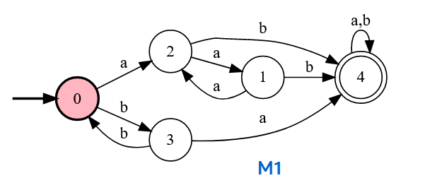

#### b. M2
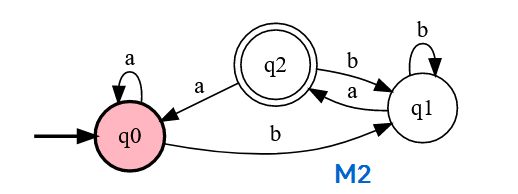

### \#4.2. M1 ∪ M2
- **DFA-01-M1** : *0, 1, 2, 3 ,4*
- **DFA-02-M2**: *q0, q1, q2*

|  States      	| a  	| b  	|
|:--------:	|--------	|--------	|
| _→ 0 q0_ 	| _2 q0_ 	| _3 q1_ 	|
| _0 q1_ 	| _2 q2_ 	| _3 q1_ 	|
| _1 q0_ 	| _2 q0_ 	| _4 q1_ 	|
| _2 q0_ 	| _1 q0_ 	| _4 q1_ 	|
| _* 2 q2_ 	| _1 q0_ 	| _4 q1_ 	|
| _3 q1_ 	| _4 q2_ 	| _0 q1_ 	|
| _* 4 q0_ 	| _4 q0_ 	| _4 q1_ 	|
| _* 4 q1_ 	| _4 q2_ 	| _4 q1_ 	|
| _* 4 q2_ 	| _4 q0_ 	| _4 q1_ 	|

- **Final States**: ***2 q2, 4 q0, 4 q1, 4 q2***
 
- **Transition Diagram**

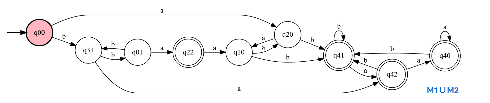

- ***Note***: ***q00 = 0 q0, q01= 0 q1, q10 = 1 q0, q20 = 2 q0, q22 = 2 q2, q31 = 3 q1, q40 = 4 q0, q41 = 4 q1, q42 = 4 q2***

### \#4.3. M1 − M2
- **DFA-01-M1** : *0, 1, 2, 3 ,4*
- **DFA-02-M2**: *q0, q1, q2*

| States        	| a  	| b  	|
|:--------:	|--------	|--------	|
| _→ 0 q0_ 	| _2 q0_ 	| _3 q1_ 	|
| _0 q1_ 	| _2 q2_ 	| _3 q1_ 	|
| _1 q0_ 	| _2 q0_ 	| _4 q1_ 	|
| _2 q0_ 	| _1 q0_ 	| _4 q1_ 	|
| _2 q2_ 	| _1 q0_ 	| _4 q1_ 	|
| _3 q1_ 	| _4 q2_ 	| _0 q1_ 	|
| _* 4 q0_ 	| _4 q0_ 	| _4 q1_ 	|
| _* 4 q1_ 	| _4 q2_ 	| _4 q1_ 	|
| _4 q2_ 	| _4 q0_ 	| _4 q1_ 	|

- **Final States**: ***4 q0, 4 q1***
- **Transition Diagram**

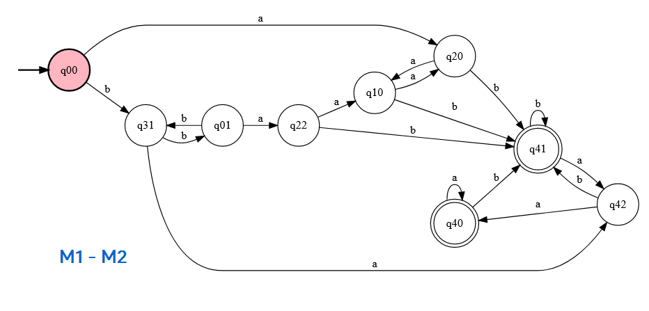

- ***Note***: ***q00 = 0 q0, q01= 0 q1, q10 = 1 q0, q20 = 2 q0, q22 = 2 q2, q31 = 3 q1, q40 = 4 q0, q41 = 4 q1, q42 = 4 q2***

### \#4.4. M1'
- **DFA-01-M1** : *0, 1, 2, 3 ,4*

| States       	| a  	| b  	|
|:--------:	|--------	|--------	|
| _→ * 0_ 	| _2_ 	| _3_ 	|
| _* 1_ 	| _2_ 	| _4_ 	|
| _* 2_ 	| _1_ 	| _4_ 	|
| _* 3_ 	| _4_ 	| _0_ 	|
| _4_ 	| _4_ 	| _4_ 	|

- **Final States**: ***0, 1, 2, 3***
- **Transition Diagram**

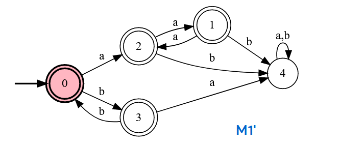

### \#4.5. M2*
- **DFA-01-M1** : *q0, q1, q2*

| States       	| a  	| b  	|
|:--------:	|--------	|--------	|
| _→ q0_ 	| _q0_ 	| _q1_ 	|
| _q1_ 	| _q2_ 	| _q1_ 	|
| _* q2_ 	| _q0_ 	| _q0_ 	|

- **Final States**: ***q2***
- **Transition Diagram**

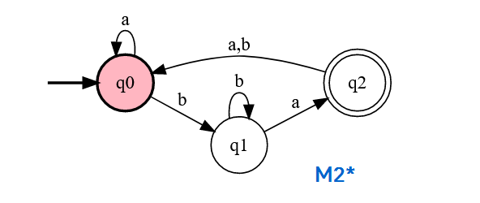
 

-----------------------------------------------------------------------------------------------------------------------
