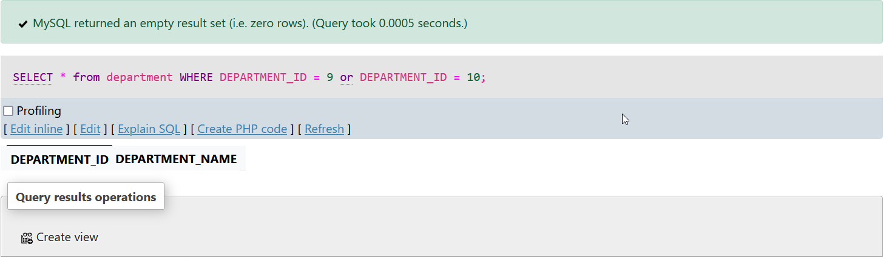
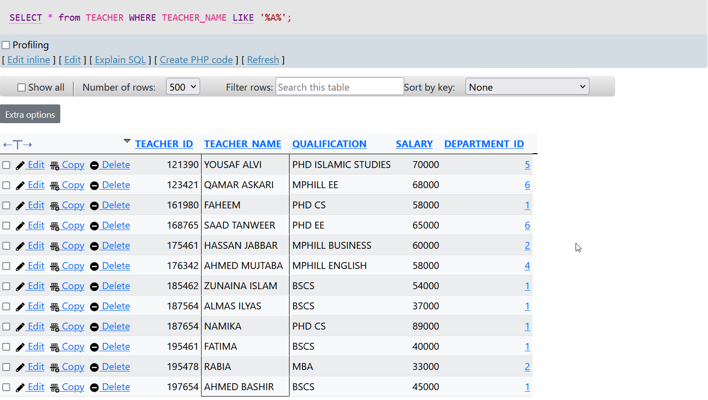
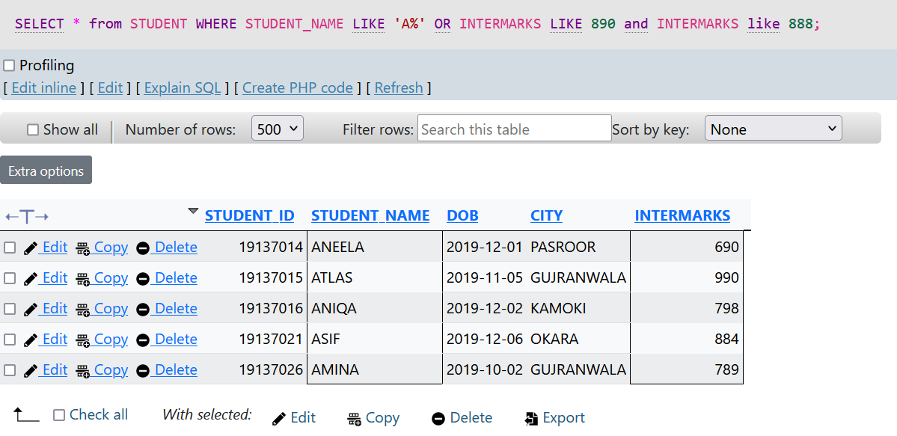
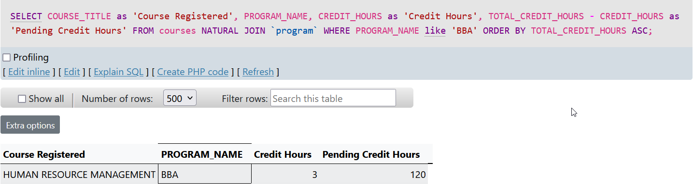
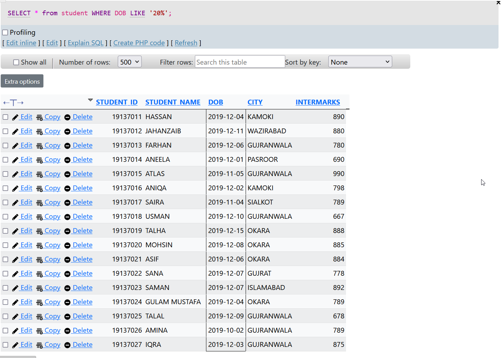
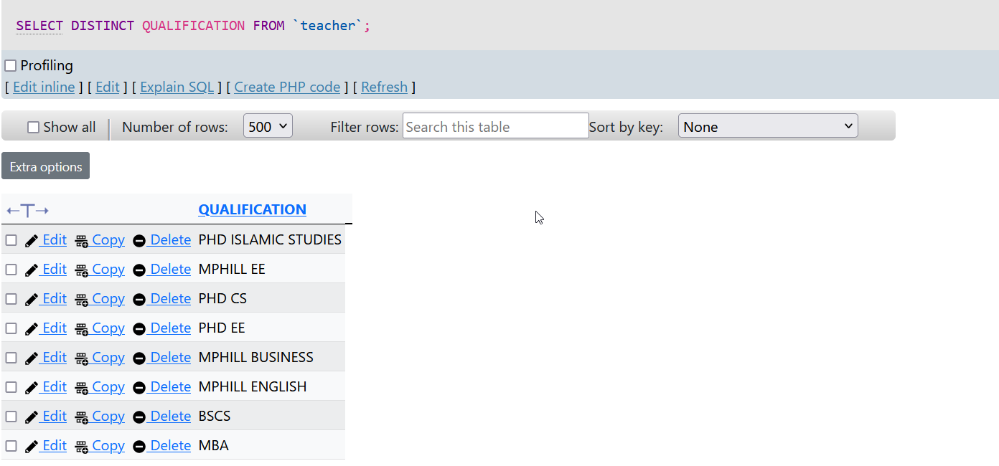
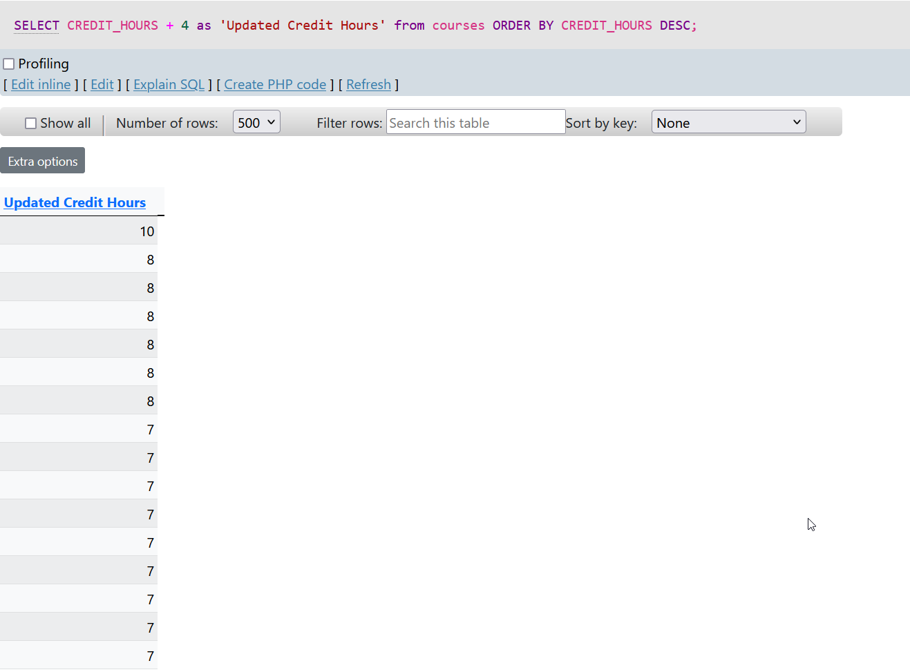
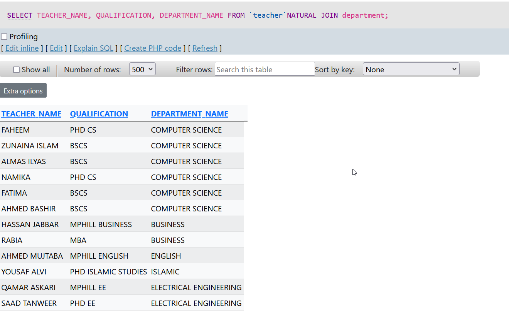
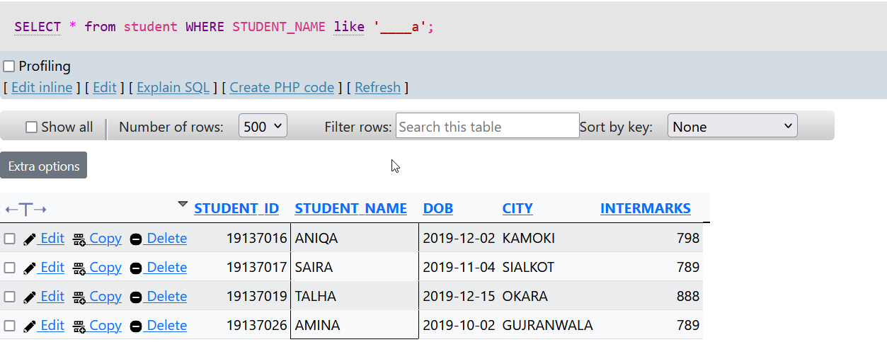
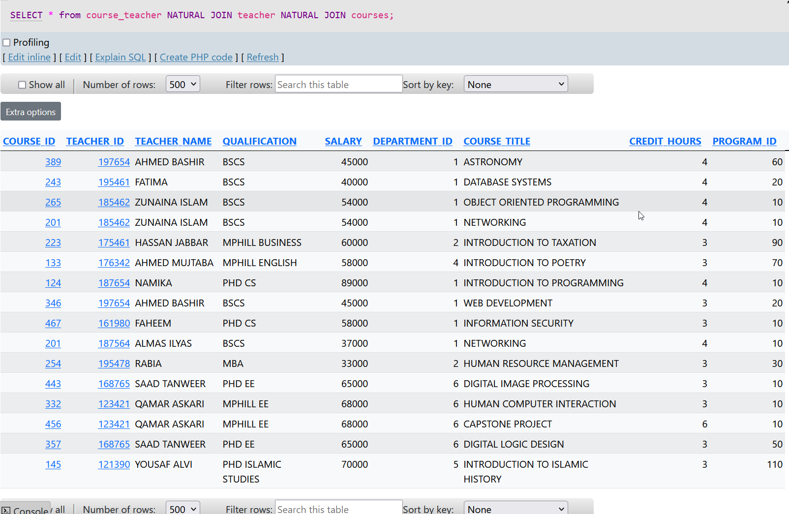

<h1>
<br>
<center>Assignment # 02</center>
 Muhammad Salman <br>212370003<br> CS-243 &#8211;  Database Systems Lab
<br>

</h1>

<br>

## 1. Write an SQL statement that displays the data of departments having id 9 or id 10.
### <center>MySQL Query</center>

```sql

SELECT * from department WHERE DEPARTMENT_ID = 9 OR DEPARTMENT_ID = 10; 

```
<br>

### <center>Query Result</center>


<p align="center">
    <hr width="80%">
</p>

## 2. Write an SQL statement that display all teachers whose name have A.
### <center>MySQL Query</center>
``` sql

SELECT * from TEACHER WHERE TEACHER_NAME LIKE '%A%'; 

```
<br>

### <center>Query Result</center>


<p align="center">
    <hr width="80%">
</p>

## 3. Display those students whose name starts with A or have intermediate marks 890 and 888.

### <center>MySQL Query</center>
```sql

SELECT * from STUDENT WHERE STUDENT_NAME LIKE 'A%' OR INTERMARKS LIKE 890 and INTERMARKS like 888; 

SELECT * from STUDENT WHERE STUDENT_NAME LIKE 'A%' OR INTERMARKS BETWEEN 890 and 888; 

SELECT * from STUDENT WHERE STUDENT_NAME LIKE 'A%' OR INTERMARKS BETWEEN 888 and 890; 

```

### <center>Query Result</center>



## 4. Write an SQL statement that displays the name of course as “Course Registered”, program name, credit hour of the courses renames as “Credit Hours” as well as subtracting course credit hours from total credit hours of BBA program. Rename the column as “Pending Credit Hours”. Sort total credit hours in asc order.

### <center>MySQL Query </center>

```sql

SELECT COURSE_TITLE as 'Course Registered', PROGRAM_NAME, CREDIT_HOURS as 'Credit Hours', TOTAL_CREDIT_HOURS - CREDIT_HOURS as 'Pending Credit Hours' FROM courses NATURAL JOIN `program` WHERE PROGRAM_NAME like 'BBA' ORDER BY TOTAL_CREDIT_HOURS ASC; 

```

### <center>Query Result</center>



## 5. Write an SQL statement that displays the students who was born at 20.

### <center>MySQL Query </center>

```sql

SELECT * from student WHERE DOB LIKE '20%'; 

```

### <center>Query Result</center>



<!--  -->

## 6. Write an SQL statement that displays unique qualification of teachers.

### <center>MySQL Query </center>
```sql

SELECT DISTINCT QUALIFICATION FROM `teacher`; 

```

### <center>Query Result</center>


## 7. Write an SQL statement that displays the credit hours of all courses and add 4 credit hours in the original credit hours, rename the output column as “updated credit hours”. Display the updated credit hours in such a way that the maximum credit hours should be at top.

<br>

### <center>MySQL Query </center>
```sql

SELECT CREDIT_HOURS + 4 as 'Updated Credit Hours' from courses ORDER BY CREDIT_HOURS DESC; 

```
### <center>Query Result</center>



## 8. Head wants to enlist all the teacher’s name, qualification, department name, so that he gets to know which new teacher of particular qualification he need to assign for next semester’s course. Write a SQL statement to display the required information.

### <center>MySQLQuery</center>
```sql

SELECT TEACHER_NAME, QUALIFICATION, DEPARTMENT_NAME FROM `teacher`NATURAL JOIN department; 

```

<br>
<br>
<br>


### <center>Query Result</center>


## 9. Write an SQL statement that displays all the students whose name contains 5 characters and ends with a.
### <center>MySQL Query</center>
```sql

SELECT * from student WHERE STUDENT_NAME like '____a'; 

```
### <center>Query Result</center>


## 10. Section Head is assigned a task to come up with the list of courses as well as teachers who are assigned with that course. You are required to convert this task in the form of SQL statement so that he/she can submit the assigned task timely.

### <center>MySQL Query</center>
```sql

SELECT * from course_teacher NATURAL JOIN teacher NATURAL JOIN courses;

```
### <center>Query Result</center>

