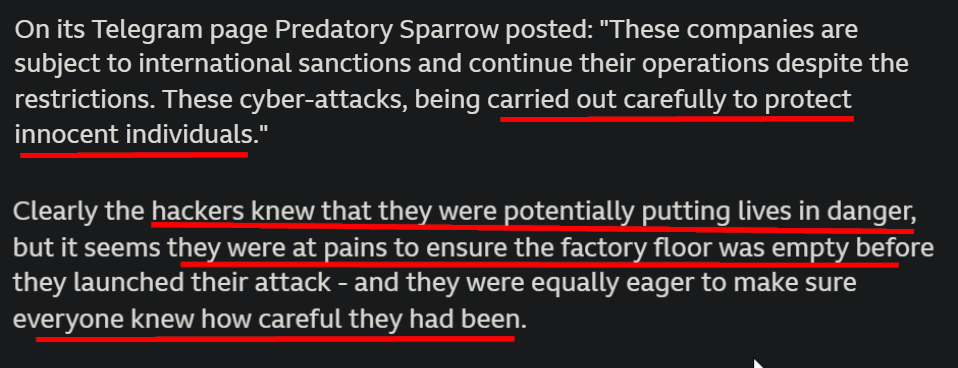
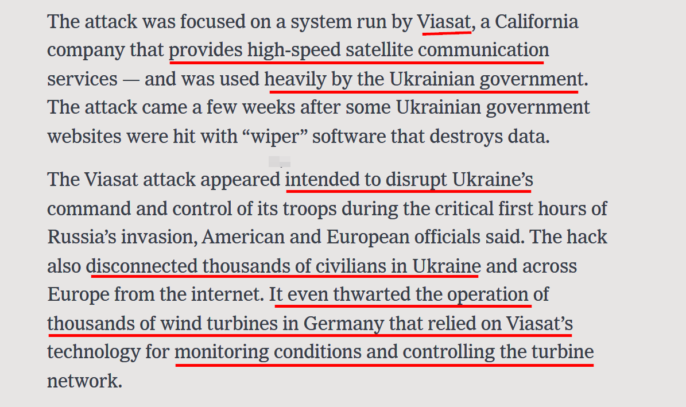
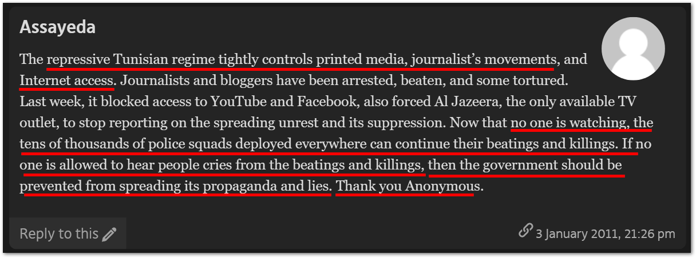

<h1>
 

Assignment # 03

 Muhammad Salman  212370003  SS-404B - Professional Practices
 

</h1>

# Answer # 1

## Abstract

Mainstream media seems to be partially biased against hackers based upon their geography. Western Hackers are described as unsung heroes who're fighting for the oppressed people against the oppressive regimes and are helping people to keep the true spirit of democracy alive. On contrary, a non-western hacker would be labelled as someone who's breaching someone's' privacy, performing surveillance and stealing their personal data for personal gain. There are **exceptions for Hacktivists** that're loved in both parts of the world likes of **Aaron Swartz**.

### 1\. ==Predatory Sparrow - Hackers who started fire in IRAN==

A hacking group **Predatory Sparrow** is in news for its operations against Islamic Republic Iran. The group started fire in the copper-pot of the steel plant by a cyber-attack. Although no causalities were reported in this incident, it shows how things can quickly escalate. BBC while reporting this incident seems to be in praise of hacking group as can be seen in the below images. Remember some reports suggests that Predatory Sparrow is nation-sponsored hacking group with fingers pointing towards Israel, which is seen as an western ally.

### 2\. ==Anonymous - Hackers trying to Undermine Putin==

Anonymous - A hacktivist collective has declared **Cyber War** on Russia in retaliation of the invasion of Ukraine. Anonymous has pulled off some serious cyber-attacks on Russian critical infrastructure including disrupting rail-services, hack on Russian TV, taken down Russian websites and stolen government data. Mainstream media is portraying the group as **"Heroes"** who are trying to restore the peace in Ukraine by undermining Putin as these attacks cause disruption and carry embarrassment.

### 3\. ==Russian Cyber Attack on Ukraine==

Few hours before the Ukraine invasion of Russia, western intelligence agencies believes that Russian Military Intelligence pulled off a cyber attack that took satellite communications in Ukraine offline. The attack rattled pentagon officials and military industry as it revealed new vulnerabilities in global communication systems. Mainstream media argues that the US seems to be in shock as the cyber war is reaching to its all time new heights and they need more people to be cyber-warriors.

### 4\. ==Arab Spring - Anonymous Role==

Anonymous played a pivotal role in Arab Spring, and many of their services are appreciated by large masses. Anonymous in their traditional manner, launched a series of DDOS attacks against government sites taking them offline. Anonymous also provided digital care package, among other things, including **Tor**, a **greasemonkey script** to avoid proxy interception by government. They also aided in passing information about protesters in and out of the country. Tunisian masses were in praise of Anonymous as reported by different media outlets for their support against oppressive Tunisian regime.

### 5.==Aaron Swartz Case==

Aaron Swartz was a programmer, internet activist, writer, political activist and a hacktivist.
He was truly a technological genius. As a teenager, he co-authored RSS, helped built a free public library at **Archive.org**, co-authored **Reddit** and liberated tons of government data. He also wrote the code-base of Creative Commons Licence (CC).
He was also a vocal supporter of **PACER**. In July 2012, he was charged of gaining illegal access to **JSTOR**, a subscription based service for distributing science and literary journals, and downloaded their entire library, 4.8 million articles and documents. Charges in the case, including wire fraud and computer fraud, were pending at the time of Swartz’s death, carrying potential penalties of up to 35 years in prison and $1Million in fines.
He died at the age of 26, apparently of suicide. To many he was a hero, who's making information publicly available, but to some he was a thief who is stealing information by the use of computer commands. **When anonymous group hacked the State Department website, they declared, "Aaron Swartz, this is for you."**

# Answer # 2

## Usage of Biometrics

- Biometrics are basically used for security and identification process. Following are the scenarios where biometrics are being used.
    - Staff attendance, fingerprint and iris identification for security purposes.
    - Safe city projects implements biometric systems to ensure individuals safety by using facial recognition software's which implements biometrics in their hood.
    - Government has implemented a biometric system last year that facilitates identity verification of pension earners in the country. Pensioners won't have to go through the inconvenient process of submitting life certificates to pension offices yearly or making physical appearance to show proof of life.
    - Banking transactions often requires the use of biometrics.

## Applications and Benefits of Using Biometrics

## 1\. Convenient Method for Authentication

Biometrics make user authentication convenient and secure at the same time. There is usually inverse relationship between enhanced security and user convenience, but biometrics is defying all the odds, making authentication seamlessly secure, reliable and convenient all at the same time. User just have to enroll his/her fingers over the scanner (or other ways for different methods) to authenticate himself as legitimate user. No need to remember lengthy passwords and 2FA to identify himself as an legitimate user.

## 2\. Spoofing Prevention

Biometrics are hard to spoof, unlike phishing attacks where user unknowingly enters his credentials to the phishing site restricting him out of his account. But that's not the case with biometrics. Biometric identifiers such as fingerprints, retina and voice are unique by definition. Biometric identification relies on biological traits which are hard to replicate and by technologies like **liveness detection**, it has only become harder to replicate an individuals biometric identifier.

## Risks of Using Biometrics

## 1\. Data Breach and Privacy Concerns

Identity theft is extremely profitable in the age of Internet, so hackers spend a lot of their time circumventing those tighten measures to impersonate their victims. Biometric data can be used for wide range of tasks, e.g. Marketers have been experimenting with facial expressions to track customers in malls.
In the event of a data breach, your bank can change your password or issue a new credit card but if your unique identification or the algorithm that processes it gets stolen, the implications are worse than one can imagine.
Victims of such attacks will find themselves in trouble participating in daily life activities like buying, selling and engaging with government agencies.

## 2\. Error Possibility and Cost

Much has been said in praise of this life-changing tech but the reality is that biometric devices aren't perfect and will make errors, which makes sense as it has been developed by human.
Possible errors includes **false acceptance**, in which the device accepts an unauthorized person and **false rejection**, in which the legitimate user gets rejected by the device. Other possible errors may includes **enrollment failure** in which the device fails to enroll a new user.
Although fingerprint scanners are now relative inexpensive, more accurate and reliable biometric technologies are often quite expensive. One way to significantly reduce these costs is to use these scanners with existing devices like Smart Phones, as the authentication method.

# Answer # 3

## a. Abstract

The site is adding the copyrighted material to its filter database so that whenever anyone tries to publish the copyrighted material, it won't be uploaded as it is present in the filter database. Copyrighted material is added to the filtered database upon the request of the author.

One point where the site is losing their defense, is that when the content has been uploaded once, it should get in their filter database directly to prevent the material from being posting again without authors permissions. Subsequently, they shouldn't be storing the work upon the authors request in filtered database, but every new content should get uploaded to the filtered database and if the author wants to transfer the copyrights he/she may asks the site to remove it from the database to complete the agreement.

## b. Author's Case

Author claims that the site is infringing her copyrights by storing the data on their filter database. Author is being preventing from selling off her rights to individuals by the site by placing her work on the filter database, and marking it as copyrighted.
According to DRM, an author can sell off or transfer the copyrights to another individual in return for a lump sum payment or periodic payment known as **Royalty**. Website is preventing the Author's right to the royalty by storing her work on to filter database.

## c. Site's Defense

Site claims that they're protecting the authors original work by filtering the copyrighted work upon the request of the author. If author don't wants to filter out his copyrighted work, then she shouldn't asks us to remove these material.