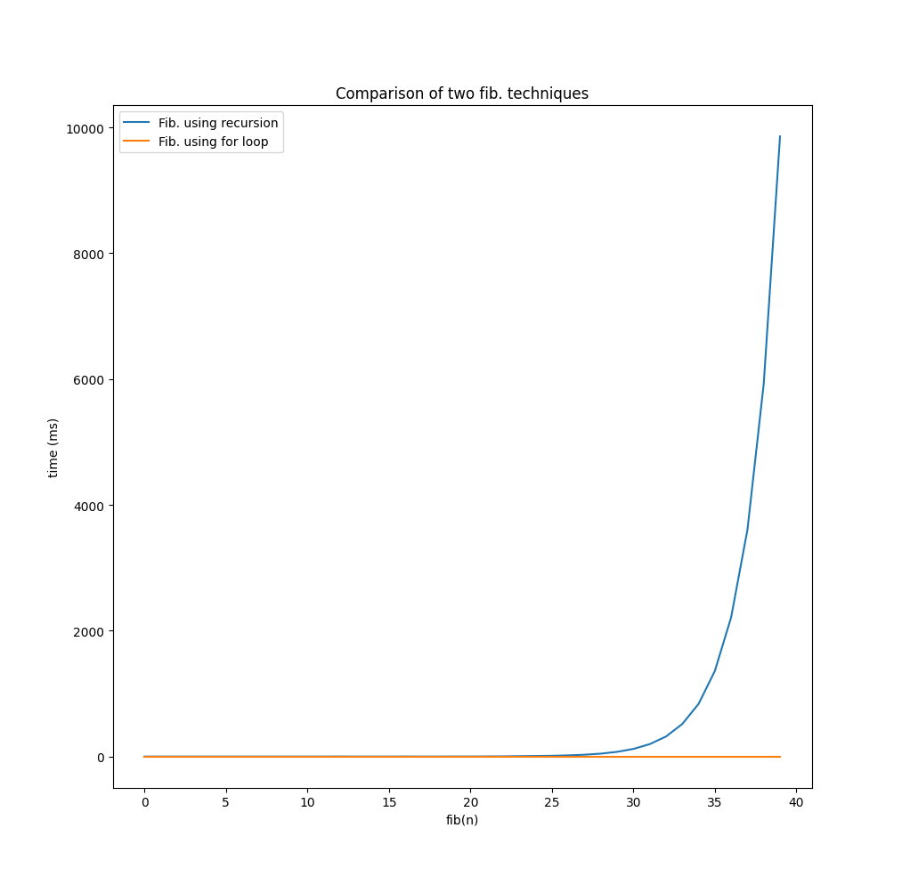

# Order of Growth

Recall fibonacci series,

$1, 1, 2, 3, 5, 8, 13, 21, 34,...$

$fib(n) = fib(n-1) + fib(n-2)$

We had two alternative for computing $fib(n)$, let's compute their execution time differences.

```python
# using recursion
def fib1(n):
    if(n <= 1):
        return 1
    return fib1(n-2) + fib1(n-1)

# with for loop
def fib2(n):
    a, b = 1, 1
    for i in range(n):
        a, b = b, a + b
    return a

# compute execution time of program
import time

def compute_time(fn, limit):
    l = []
    for i in range(limit):
        start_time = int(round(time.time() * 1000))

        fn(i) 

        time_taken = int(round(time.time() * 1000))
        difference = time_taken - start_time

        l.append(difference)

    return l

limit = 40
fib1_times = compute_time(fib1, limit)
fib2_times = compute_time(fib2, limit)

print(fib1_times)
print(fib2_times)

# plot the difference
import matplotlib.pyplot as plt

plt.figure()
plt.title("Comparison of two fib. techniques")
plt.xlabel("fib(n)")
plt.ylabel("time (ms)")

plt.plot(fib1_times, label="Fib. using recursion")
plt.plot(fib2_times, label="Fib. using for loop")

plt.legend()
plt.show()
```

and the results are as follows:



See the exponential rise, as the $n$ of $fib(n)$ increases, the time cost for using recursive to calculate fib. sum grows exponentially.
