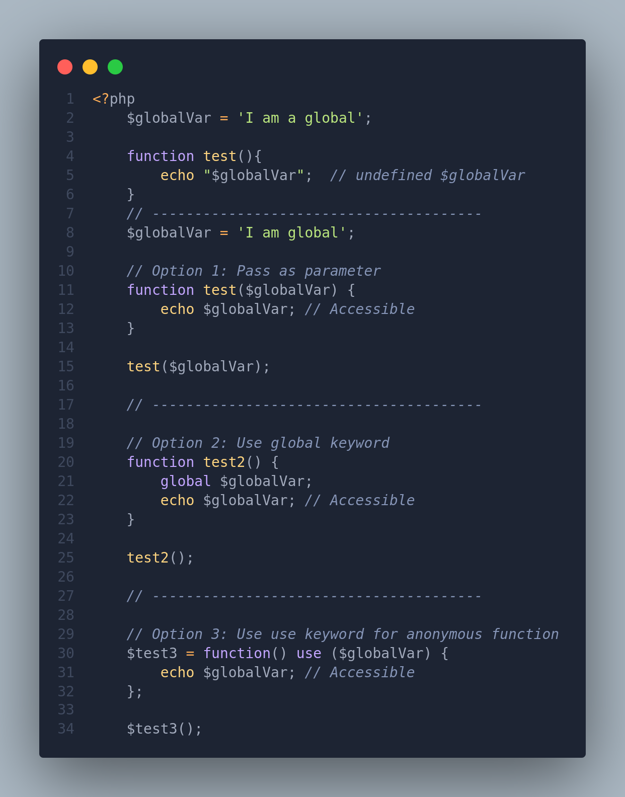
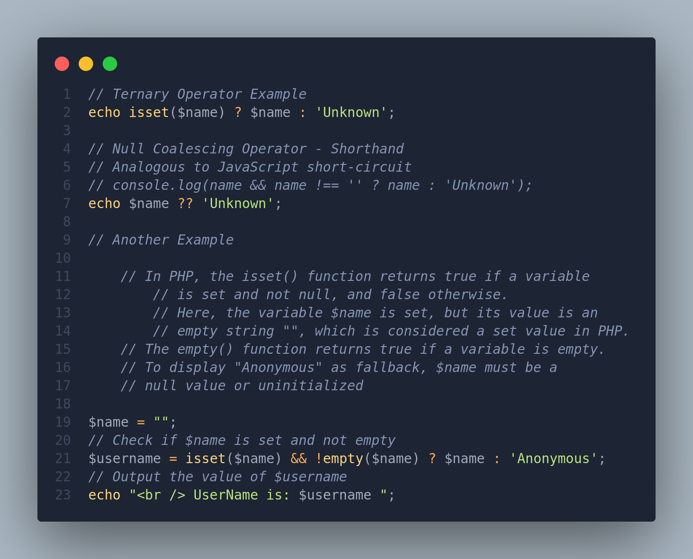

# PHP Basics

PHP (Hypertext Preprocessor) is a server-side scripting language used primarily for web development. Below are some fundamental concepts of PHP:

## PHP Learning Resources

- [PHPApprentice](https://phpapprentice.com)
- [PHPTheRightWay](https://phptherightway.com/)
- [Checkout the Others also](./Installation.md#instructors)

## Syntax and Variables

```php
<?php
    // PHP code starts with <?php and ends with ?>
    $name = "John"; // Variable declaration
    $age = 25;
    echo "Hello, $name!"; // Output: Hello, John!
    echo "Sum of 2 + 2 is " . (2+2);
?>
```

> For debugging/testing purposes and for nice syntax, use `dd()` which stands for dump and die over var_dump().
>> **One thing to keep in mind, `dd()` will stop the script's execution**.

### Variable Scope

- Unlike traditional programming languages like Java, Python or JS, variable scope in PHP is a bit different. Variables outside of a function (global variables) are not accessible within the functions(SHOCKED HERE!!!).
  - To access global variables within functions, you have a few options:
    - Pass them as parameters to the function when it's called.
    - Use the `global` keyword inside the function to explicitly declare the variable as global.
    - If the function is an anonymous or lambda function, you can use the `use` keyword to import variables from the outer scope.

    

## Single vs Double Quotes

In PHP, both single quotes (`''`) and double quotes (`""`) can be used to define strings, and each has its own use case.

### Single Quotes (`''`)

- String literals are treated literally, meaning escape sequences (like `\n` for newline) and variable interpolation (e.g., `$name`) are not parsed.
  - Single quotes are generally faster because PHP doesn't have to parse the string for variables or escape sequences.

### Double Quotes (`""`)

- String literals are parsed, meaning escape sequences and variable interpolation are processed.
  - Double quotes are typically used when you want to include variables or escape sequences within the string.

   ```php
   // Taken from Stackoverflow
    $s = "dollars";
    echo 'This costs a lot of $s.'; // This costs a lot of $s.
    echo "This costs a lot of $s."; // This costs a lot of dollars.
   ```

### `echo` and `print`

### `echo`

- `echo` is a language construct, not a function, so the parentheses are optional.
  - It can take multiple parameters and does not return a value.
  - It's slightly faster compared to `print`.
- **PHP Short `echo` Syntax:** If you just want to `echo` the variable value to the webpage, you don't need to use typical php syntax to do it `<?php ?>`, you can instead use a short syntax of `<?= $var_name ?>`
  
   ```php
   <?php
        $name = 'Dave';
        <?= $name ?>    // echo's the variable to webpage
        echo "Hello, world!";
        echo "This ", "is ", "a ", "concatenated ", "string.";
   ?>
   ```

### `print`

- `print` is a function, so the parentheses are required.
  - It can only take one argument and returns 1, always.
  - It's slightly slower compared to `echo`.

   ```php
   <?php
    print "Hello, world!";
   ?>
   ```

- In PHP, when you use double quotes ("), escape sequences like `\n` are interpreted as newlines. However, if you want to output a newline on HTML pages or in text, you need to use the HTML newline character `<br>` instead of `\n`.

### `php -S localhost:8888`

- This command is used to start a simple PHP server locally.
- `-S` flag specifies the address and port to run the server.
- `localhost:8888` means the server will be accessible at `http://localhost:8888` in the browser.

  - The built-in PHP development server does not automatically restart when you make changes to your PHP files.

### Difference between `index.html` and `index.php`

- PHP files are typically used for dynamic content generation, while HTML files are used for static content presentation. Using `index.php` allows you to include dynamic content and interact with server-side resources.

1. **index.html**:
   - HTML file.
   - Contains static content.
   - Cannot execute PHP code.

   ```html
   <!DOCTYPE html>
   <html>
    <head>
        <title>HTML Page</title>
    </head>
    <body>
        <h1>Hello, world!</h1>
    </body>
   </html>
   ```

2. **index.php**:
   - PHP file.
   - Can contain both HTML and PHP code.
   - PHP code can be executed within `<?php ?>` tags.

   ```php
   <!DOCTYPE html>
   <html>
    <head>
        <title>PHP Page</title>
    </head>
    <body>
        <h1>Hello, <?= $name ?>!</h1>
        <p>Age: <?= $age ?></p>
    </body>
   </html>
   ```

## Data Types

- String: `"Hello"`
  - Strings can be concatenated using the period (`.`)character in between them.
- Integer: `25`
- Float: `3.14`
- Boolean: `true` or `false`
- Array: `["apple", "banana", "cherry"]`
- Object: `$person = new Person()`

## Operators

- Arithmetic: `+`, `-`, `*`, `**`, `/`, `%`
- Assignment: `=`, `+=`, `-=`, `*=`, `/=`, `%=`
- Comparison: `==`, `===`, `!=`, `>`, `<`, `>=`, `<=`
  - `===` checks if the values are equal and of the same data type.

    ```php
    // These return true
    1 == 1;
    1 == '1';
    1 == true;
    1 == 1.0;
    1 === 1;
    // These return false
    1 === '1';
    1 === true;
    1 === 1.0;
    ```

- Logical: `&&`, `||`, `!`

## Control Structures

### If Statement

```php
<?php
    if ($age >= 18) {
        echo "You are an adult.";
    } else {
        echo "You are a minor.";
    }
?>
```

### Ternary Operator &mdash; Single Line Conditionals

- PHP ternary operator have the same syntax as of JS ternary operator:
  - `(condition) ? (value if true) : (value if false)`



### Loops

- [Click here to learn more about php loops](./PHP%20Loops.md)

- **While Loop**

```php
<?php
    $i = 0;
    while ($i < 5) {
        echo $i;
        $i++;
    }
?>
```

- **For Loop**

```php
<?php
    for ($i = 0; $i < 5; $i++) {
        echo $i;
    }
?>
```

## Functions

- [Click here to read more about php functions](./PHP%20Functions.md)

```php
<?php
    function greet($name) {
        echo "Hello, $name!";
    }
    greet("Alice"); // Output: Hello, Alice!
?>
```

## Arrays

- [Click here to learn more about php arrays](https://phpapprentice.com/arrays)
- [Master PHP Array Functions](https://startutorial.com/view/master-php-array-functions)
- [PHP Array Functions](https://dev.to/karleb/10-php-array-functions-and-how-to-use-them-462n)

```php
<?php
    $fruits = ["apple", "banana", "cherry"];
    echo $fruits[0]; // Output: apple
?>
```

- An associative array in PHP is a type of array where each element is associated with a specific key, rather than being indexed numerically like in a standard array.
  - In associative arrays, keys can be either numeric or string values, providing a way to uniquely identify each element.

Here's an example of an associative array:

```php
<?php
    $car = ["make" => "Toyota", "model" => "Camry", "year" => 2022];
?>
```

In this associative array:

- `"make"`, `"model"`, and `"year"` are the keys.
- `"Toyota"`, `"Camry"`, and `2022` are the corresponding values associated with each key.

To access the values in an associative array, you use the keys instead of numeric indices:

```php
echo $car["make"];   // Output: Toyota
echo $car["model"];  // Output: Camry
echo $car["year"];   // Output: 2022
```

## Classes and Objects

```php
<?php
    class Person {
        public $name;
        public $age;
        
        function __construct($name, $age) {
            $this->name = $name;
            $this->age = $age;
        }
        
        function greet() {
            echo "Hello, my name is $this->name.";
        }
    }

    $person = new Person("John", 25);
    $person->greet(); // Output: Hello, my name is John.
?>
```

## Error Handling

```php
<?php
    try {
        // Code that may throw an exception
        throw new Exception("An error occurred!");
    } catch (Exception $e) {
        echo "Error: " . $e->getMessage();
    }
?>
```
