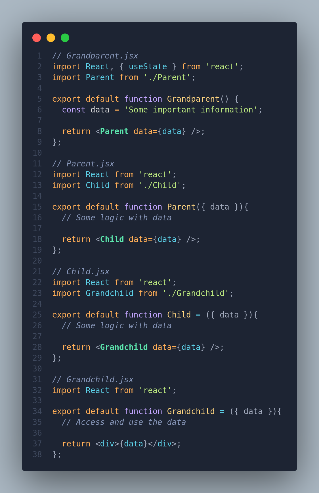

# React Props

- Props enable the creation of configurable components.
- They allow components to receive and utilize external data.
- In a component declaration, we pass `props` as a parameter to access the data.
  - We call the `Greeter` component and pass the `name` as its argument.
  - The syntax resembles HTML attribute syntax, such as `<a href="https://google.com">` or `<input type='password'>`.

    ```jsx
    // App.jsx --- Component Definition

    import Greeter from './Greeter'

    export default function App(){
      return (
        <Greeter name='David' />
        <Greeter name='Milan' />
      );
    }
    ```

  - The `Greeter` component then uses the passed arguments.

    ```jsx
    // Greeter.jsx --- Component Definition

    export default function(props){
      console.log(props);
      return(
        <h1>Hi there, {props.name}</h1>;
      )
    }
    ```

## Destructuring Props

- Destructuring simplifies the use of props by directly extracting required properties.
- Instead of `props.name`, we can use `{ name }` directly.

    ```jsx
    export default function({ name }){
      console.log(name);
      return (
        <h1>Hi there, {name}</h1>;
      )
    }  
    ```

## Passing Multiple Props

- When calling a component, you can provide multiple attributes, each representing a different prop, just like you would with HTML attributes

  ```jsx
  // Greeter.jsx --- Component Definition

    export default function({ name, from }){
        console.log(props);
        return (
            <h1>Hi there, {name} &mdash; {from}</h1>;
        )
    }   
  ```

**`Component Definition (e.g., App.jsx):`**

  ```jsx
  // App.jsx --- Component Definition

      // import Greeter from './Greeter';

      // function App() {
      //   return (
      //     <>
      //       <Greeter name="David" from="Milan" />
      //       <Greeter name="Alice" from="New York" />
      //     </>
      //   );
      // }

      // export default App;

  import Greeter from './Greeter';

  export default () => <Greeter name='David' from='NYC' />;
  ```

## Passing Non-String Props

- For non-string props, use `{}` to pass JavaScript expressions.
  - To create a different-sided dice roll

  ```jsx
  export default function Die({ numSided }){
    return (
      const roll = Math.floor(Math.random() * numSided) + 1;
      <p>{numSided}-sided die roll: {roll};
    )
  }
  ```

  ```jsx
  // App.jsx --- Component Definition

  import Die from './Die'

  export default function App(){
    return (
      <Die numSided={20} />
      <Die numSided={10} />
      <Die numSided={6} />
    )
  }
  ```

## Setting Default Props Values

- Setting default values for props in React is achieved using the same syntax as providing default values for JavaScript object properties. This ensures that if a prop is not explicitly passed when using a component, it defaults to the specified value.

  ```jsx
  // Die.jsx --- Component Definition

  export default function Die({ numSided = 6 }) {
    const roll = Math.floor(Math.random() * numSided) + 1;
    return (
      <h4>
        {numSided}-sided roll: {roll}
      </h4>
    );
  }
  ```

- If `numSided` is not passed, it defaults to 6.

  ```jsx
  // App.jsx --- Component Definition

  import Die from './Die'

  export default function App() {
    return (
      <Die numSided={20} />
      <Die numSided={10} />
      <Die />
    )
  }
  ```

## `key` Prop

- Special prop that we use to tell a [diffing algorithm](./React%20Working%20Behind%20Scenes.md#diffing-rules) that a certain element is **unique**, works both for DOM and React Elements.
- Allows React to **distinguish** between multiple instances of the same component

### [Check out the `key` Prop Summary](./React%20Working%20Behind%20Scenes.md#02-react-behind-the-scenes)

## Props Drilling

Props drilling is a term used in React to describe a situation where props are passed down through multiple layers of components, causing a chain or "drill" from the top-level parent component to the bottom-level child component.

### Example

Consider a scenario where a top-level component (`Grandparent`) has some data that needs to be passed down to a deeply nested component (`Grandchild`). If the intermediate components (`Parent` and `Child`) don't need the data but have to pass it down to reach the `Grandchild`, it's referred to as props drilling.



In this example, the `data` prop is drilled down from `Grandparent` to `Grandchild` through `Parent` and `Child`. If the intermediate components don't need the `data` prop, it can lead to unnecessary prop passing, which is considered prop drilling. This pattern might make the code harder to maintain and understand.

## Solutions to Prop Drilling

- To simplify the problem of props drilling and make code more readable in larger projects, we use the `children` prop implicitly and the `element` prop explicitly. This pattern is commonly seen in libraries like React Router.

### Passing `children` Prop

- In React, the `children` prop is a special prop that allows you to pass components or elements as children to another component.
- Picture it like a gap in the component that can be filled using the children prop.
  - The children prop allow us to **pass JSX into an element** (besides regular props)
  - An empty **hole** that can be **filled by any JSX, the component receives as children**
- Using `children` makes components highly reusable and configurable.
- Really useful for **generic component** that don't know their content before being used (e.g. modal)

Here's a brief overview of how the `children` prop works:

1. **Passing Button Component**

   ```jsx
   // Button.jsx
   import React from 'react';

   const Button = ({ children }) => {
     return <button>{children}</button>;
   };

   // App.jsx
   import React from 'react';
   import Button from './Button';

   const App = () => {
     return (
       <div>
       // we don't close tags like <Button /> for children props
       // Instead, follow html tags syntax
         <Button>
           <span>Click me</span>
         </Button>
       </div>
     );
   };
   ```

   Here, the `Button` component can receive other components (like the `span` element) as its children.

   [Check out react official documentation about children props](https://react.dev/learn/passing-props-to-a-component#passing-jsx-as-children)

### Using Elements as Props Instead of Children

- Instead of using the children prop, you can pass elements directly as props to achieve a similar result. Here you can see difference...

  ```jsx
    // App.jsx
    import React from 'react';
    import Button from './Button';

    const App = () => {
      return (
        <div>
          <Button element={<span>Click me</span>}/>
        </div>
      );
    };
  ```

## Passing an Array as a Prop

```jsx
// ParentComponent.jsx --- Component Definition

import ChildComponent from './ChildComponent';

function ParentComponent() {
    // const colors = ['red', 'green', 'blue'];
    // return <ChildComponent colors={colors} />;

  return <ChildComponent colors={['red', 'green', 'blue']}>
}
```

- In this example, the `ParentComponent` passes an array (`colors`) to the `ChildComponent` as a prop. The `ChildComponent` then maps over the array to display each color.

  ```jsx
  // ChildComponent.jsx --- Component Definition

  export default function ChildComponent({ colors }) {
    return (
      <div>
        <p>Colors:</p>
        <ul>
          {colors.map((color, index) => (
            <li key={index}>{color}</li>
          ))}
        </ul>
      </div>
    );
  }
  ```

## Passing an Object as a Prop

```jsx
// ParentComponent.jsx
import ChildComponent from './ChildComponent';

function ParentComponent() {
  const person = {
    name: 'John Doe',
    age: 25,
    city: 'New York',
  };

  return <ChildComponent person={person} />;
}
```

- Here, the `ParentComponent` passes an object (`person`) to the `ChildComponent` as a prop. The `ChildComponent` then accesses individual properties of the object to display information.

  ```jsx
  // ChildComponent.jsx
  export default function ChildComponent({ person }) {
    return (
      <div>
        <p>Name: {person.name}</p>
        <p>Age: {person.age}</p>
        <p>City: {person.city}</p>
      </div>
    );
  }
  ```

## React Conditionals

1. **Double Sided with Conditional Rendering:**

    ```jsx
    return (
      <>
        <h1>Dice Roll...</h1>
        <h2>{roll1 === roll2 && "You Won!"}</h2>
        <p>Roll1: {roll1}</p>
        <p>Roll2: {roll2}</p>
      </>
    );
    ```

   - **Ranking:** This approach is concise and effective. It leverages the logical AND (`&&`) to conditionally render the "You Won!" message, eliminating unnecessary elements when not needed.

   - **Deficiencies:** No significant deficiencies.

2. **Double Sided with Ternary Operator (Commented Out):**

    ```jsx
    //   return (
    //     <>
    //       <h1>Dice Roll...</h1>
    //       <h2>{roll1 === roll2 ? "You Won!" : null}</h2>
    //       <p>Roll1: {roll1}</p>
    //       <p>Roll2: {roll2}</p>
    //     </>
    //   );
    ```

   - **Ranking:** This approach uses a ternary operator for conditional rendering, which is clear and readable.

   - **Deficiencies:** It introduces an extra `<h2>` element even when the condition is not met, potentially leading to unnecessary DOM elements.

3. **Double Sided with Ternary Operator (Alternate):**

    ```jsx
    //   return (
    //     <>
    //       <h1>Dice Roll...</h1>
    //       <h2>{roll1 === roll2 ? "You Won!" : "You lost ):"}</h2>
    //       <p>Roll1: {roll1}</p>
    //       <p>Roll2: {roll2}</p>
    //     </>
    //   );
    ```

   - **Ranking:** Similar to the second approach, but with condition inlined.

   - **Deficiencies:** Similar to the second approach, introducing an extra heading element in the DOM when the condition is not met.

4. **Double Sided with Assigned Message Variable:**

    ```jsx
    //   const mssg = roll1 === roll2 ? "You Won!" : "You lost ):";
    //   return (
    //     <>
    //       <h1>Dice Roll...</h1>
    //       <h2>{mssg}</h2>
    //       <p>Roll1: {roll1}</p>
    //       <p>Roll2: {roll2}</p>
    //     </>
    //   );
    ```

   - **Ranking:** Decent approach, storing the message in a variable for readability.

   - **Deficiencies:** Still introduces an extra heading element in the DOM when the condition is not met.

5. **Double Sided with Conditional Rendering (Worst Way):**

      ```jsx
      /* Worst Way */
      //   if (roll1 === roll2) {
      //     return (
      //       <>
      //         <h1>Dice Roll...</h1>  
      //         <h2>You Win!</h2>
      //         <p>Roll1: {roll1}</p>
      //         <p>Roll2: {roll2}</p>
      //       </>
      //     );
      //   }
      //   return (
      //     <>
      //       <h3>You Lost ):</h3>
      //       <p>Roll1: {roll1}</p>
      //       <p>Roll2: {roll2}</p>
      //     </>
      //   );
      ```

   - **Ranking:** This approach involves conditional rendering using an `if` statement.

   - **Deficiencies:** This method has the drawback of repeating the message element (`<h3>`) in both conditions, resulting in duplicated code.

## React Developer Tools

| Step | Description |
|------|-------------|
| 1.   | **Install Extension:** Visit the Chrome Web Store or Firefox Add-ons. Search and install "React Developer Tools." |
| 2.   | **Open Developer Tools:** Right-click on the webpage and choose "Inspect" to open Developer Tools. |
| 3.   | **Navigate to "React" Tab:** Open the "React" tab in Developer Tools. |
| **Check Components Tab** |  |
| 1.   | **View Component Hierarchy:** Expand/collapse components to navigate. |
| 2.   | **Inspect State and Props:** Click on a component to view state and props. |
| 3.   | **Search and Filter:** Use search and filters to find components. |
| 4.   | **Interact with Components:** Trigger state changes and view current state. |

## Adding Dynamic Styling in React

In React, we often use an inline approach for styling components dynamically. This means we define styles directly within our components using JavaScript objects.

### Creating a Style Object

- Let's dive in and create a style object for a dice box. We determine the styles based on conditions, making the visuals more flexible and reusable:

  ```jsx
  const isWinner = roll1 === roll2;
  const color = isWinner ? "green" : "red";

  const diceBoxStyle = {
    color,
    border: `1px solid ${color}`,
    marginTop: "4px",
    padding: '50px',
    boxSizing: 'border-box',
  };
  ```

  Here, `diceBoxStyle` is a JavaScript object representing CSS properties. The conditions, like `isWinner`, decide the values of these properties.

### Applying Styles Inline

- Now, let's use this style object within our component:

    ```jsx
    return (
      <div style={diceBoxStyle}> // here 
        <h1>Dice Roll...</h1>
        <h2>{isWinner && "You Won!"}</h2>
        <p>Roll1: {roll1}</p>
        <p>Roll2: {roll2}</p>
      </div>
    );
    ```

- The `style` attribute in the `<div>` applies the styles dynamically. Notice how we use `{}` to embed the JavaScript object.

  > If you haven't worked with defining CSS properties in JavaScript, the process is straightforward. Here's a simple breakdown:
  >> Single-word CSS properties such as padding, margin, and color remain unchanged.
  >>> For multi-word CSS properties with a dash (e.g., background-color, font-family, border-radius), convert them into camel case by removing the dash and capitalizing the first letter of the second word. For instance, `background-color` becomes `backgroundColor`, `font-family` becomes `fontFamily`, and `border-radius` becomes `borderRadius`.

### Important Note

Remember, if your styling is common and not dependent on conditions, it's better to place it in a separate CSS file. Inline styling in React is most effective when you need to apply styles conditionally based on the component's state or other factors.

## Rendering Arrays with Map

In React, the `map` function is a powerful tool for rendering arrays of data within your components. Let's explore how you can leverage `map` to iterate through an array and render its elements dynamically.

### Basic Usage of `map`

- Consider an array of items that you want to render:

  ```jsx
  const fruits = ['Apple', 'Banana', 'Orange'];

  const fruitList = fruits.map((fruit, index) => {
    return <li key={index}>{fruit}</li>;
  });
  ```

- The `map` function iterates over each item in the `fruits` array.
- For each element, it executes the provided callback function, which takes the current item (`fruit`) and its index as parameters.
- The JSX returned from the callback is collected into a new array (`fruitList` in this case).

### Rendering the Mapped Array

- Now, you can render the `fruitList` array within your component:

  ```jsx
  return (
    <div>
      <h1>Fruit List</h1>
      <ul>{fruitList}</ul>
    </div>
  );
  ```

- The `{fruitList}` JSX expression renders the array dynamically.
- Each fruit is wrapped in a `<li>` (list item) element.

### Key Prop in `map`

- When using `map` to render elements from an array, it's crucial to provide a unique `key` prop to each rendered element. This helps React efficiently update and re-render components when the array changes.

  ```jsx
  const fruitList = fruits.map((fruit, index) => {
    return <li key={index}>{fruit}</li>;
  });
  ```

- The `key={index}` prop assigns a unique identifier to each list item.

## Slot Machine Exercise

```jsx
// SlotMachine.jsx --- Component Definition

export default function SlotMachine({ array }) {
  const selection1 = array[Math.floor(Math.random() * array.length)];
  const selection2 = array[Math.floor(Math.random() * array.length)];
  const selection3 = array[Math.floor(Math.random() * array.length)];
  const isWinner = selection1 === selection2 && selection2 === selection3;
  const color = isWinner ? "green" : "red";
  return (
    <div style={{ border: `2px solid ${color}`, margin:'4px' }}>
      <h2>
        {selection1}
        {selection2}
        {selection3}
      </h2>
      <h3 style={{ color }}>{isWinner ? "You Won!" : "You Lost!"}</h3>
      {isWinner && <h4>Congrats 🎉</h4>}
    </div>
  );
}
```

```jsx
// App.jsx --- Component Definition

import "./App.css";
import SlotMachine from "./SlotMachine";

function App() {
  const fruitArrays = [
    "🍎 Apple",
    "🍌 Banana",
    "🍊 Orange",
    "🍓 Strawberry",
    "🍇 Grapes",
    "🍉 Watermelon",
    "🍍 Pineapple",
    "🥭 Mango",
    "🥝 Kiwi",
  ];
  return (
    <>
      <h1>Slot Machine Challenge</h1>
      <SlotMachine array={fruitArrays} />
      <SlotMachine array={fruitArrays} />
    </>
  );
}
export default App;
```

## Configuring ESLint &mdash; Props Validation Missing

- Configure ESLint rules to enforce PropTypes usage:

  ```json
  {
    "rules": {
      "react/prop-types": "false"
    }
  }
  ```
