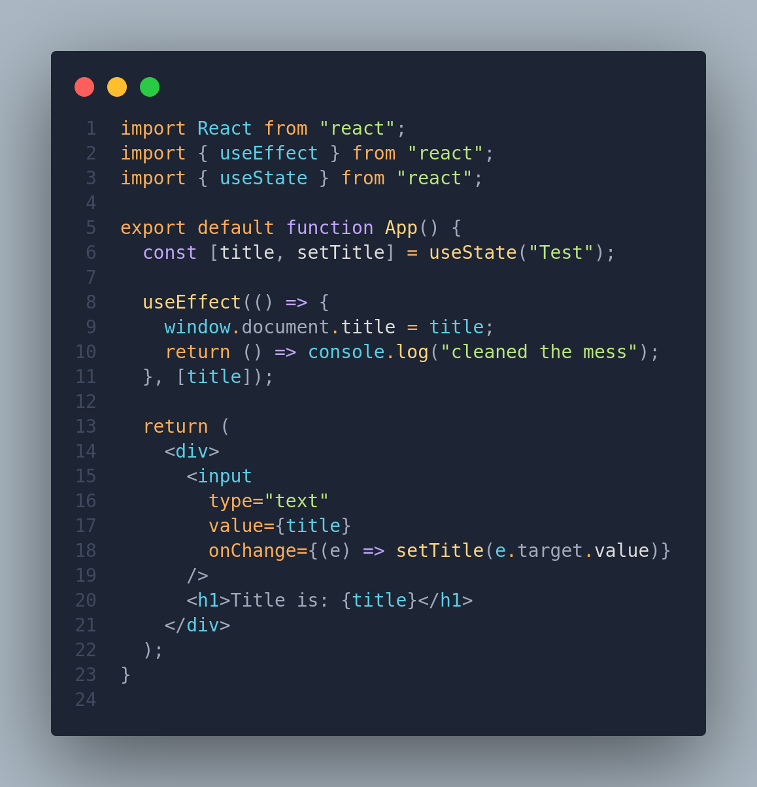

# `useEffect` Hook in React: Brief Overview

[Click here to refresh memory about side effects](./React%20Working%20Behind%20Scenes.md#functional-programming-principles) &mdash; kinda of necessary

The `useEffect` hook in React is a tool that helps manage additional tasks in your components, like fetching data or handling subscriptions, manipulating DOM.

## Introduction

- It's the second crucial hook in React, following `useState`, and allows you to perform side effects in your functional components.

## Basic Syntax

```jsx
import React, { useEffect } from 'react';

useEffect(() => {
  // Code for side effect
  fetch(url)
    .then(res => res.json())
    .then(data => console.log(data));
}, []);
```

This example demonstrates fetching data as a side effect. The empty dependency array (`[]`) ensures the effect runs only once when the component mounts.

## Dependency Array

- The most crucial part of `useEffect` is the dependency array. This array determines when the effect should run.
- By default, `useEffect` will run on every render. We can prevent this by passing a dependency array. If the array is empty, the effect runs only after the initial render (component mounting).
  - **Each time one of the dependency changes, the effect will be executed again**.
  - **Every state variable and props used inside the effect Must be included in the dependency array**. Otherwise, we get a 'stale closure'.
- `useEffect` is like an event listener that is listening for one dependency to change. Whenever a dependency is changed, it will execute the effect again.



## Clean-up Function

- Function that is returned from an effect (optional)
- Runs on two different occasions:
  - Before the effect is **executed again** &mdash; to clean up the results of the previous side effect
  - After a component instance has been **unmounted** &mdash; in order to give us opportunity to reset the side effect that we've created

## Tips

- Each `useEffect` should only do one thing! Use one `useEffect` for each side effect. This makes effects easier to cleanup using a cleanup function.
- It's necessary to have clean up function in case whenever the side effect keeps happening after the component has been re-rendered or unmounted.
  - For example, you might be doing an HTTP request in your effect. Now if the component is rendered again, while the first request is still running, a new second request would be fired off. And so this might create a bug called race condition and therefore its a good idea to cancel the request in the cleanup function whenever the component is re-rendered or gets unmounted.

    ```js
    // cancel the network operation --- return it as cleanup function
    // in the useEffect
    const cleanup = () => abortController.abort();
    ```

## JS Closures

- Closures refers to the ability of a function to retain access to variables from its outer (enclosing) scope even after the outer function has finished execution.
  - In simpler terms, a closure allows a function to remember and access the variables in its lexical scope, even when the function is executed outside that scope.

## Synchronization and Lifecycle

- Effects and component lifecycle are deeply connected:
  - Dependency (State or Props) Changes ===> Effect is executed Again
  - Dependency (State or Props) Changes ===> Component is Re-rendered
- We can use the dependency array to **run effects when the component renders or re-renders**

### When effects are executed?

- Effects are only executed after the browser has finished painting the component instance onto the screen.
- `useLayoutEffect` runs before the browser painted the component and after committing to DOM while `useEffect` runs after the components is painted.
  - This is useful as operations inside the `useEffect` might take long time to finish which then will block the component painting process and will lead to bad UX.

## Use Cases

- **Data Fetching:** Execute code to fetch data after the component mounts.
- **Subscriptions:** Set up subscriptions to external data sources.
- **DOM Manipulation:** Perform manual DOM manipulations.

## Recap

- `useEffect` is used to register side effects in functional components.
- The function passed to `useEffect` contains the code to run as a side effect.
- The dependency array determines when the effect runs; an empty array runs it only on mount and not passing array as parameter will run the effect on every render (very rare).
- Upon unmounting  or rendering again the component instance, our cleanup function will run.
