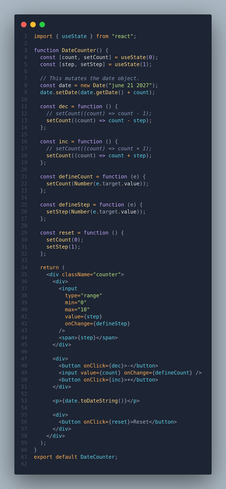
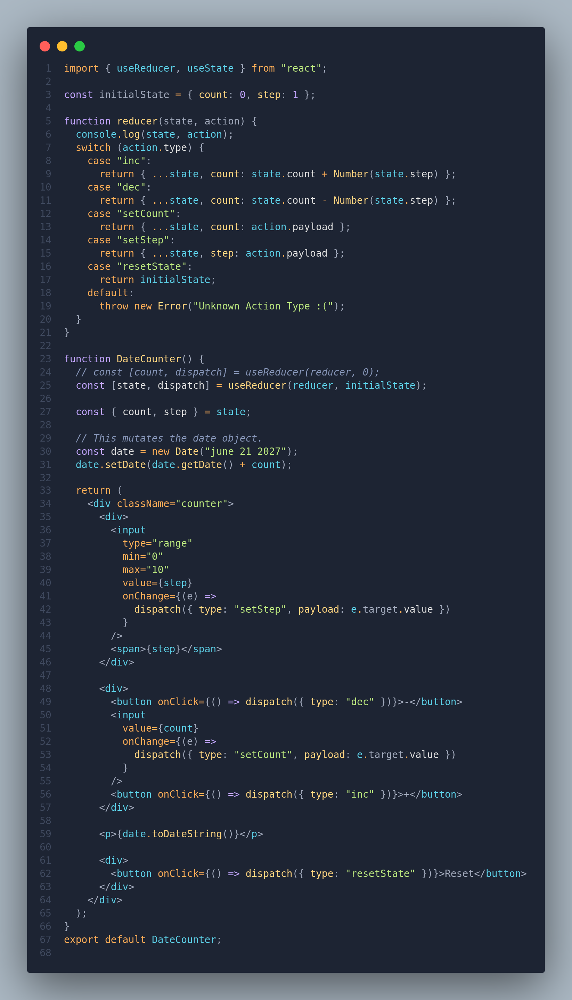
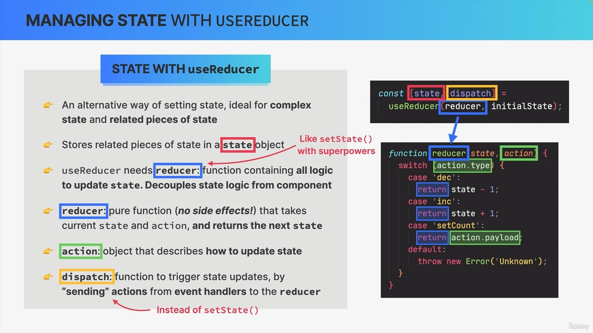

# useReducer Hook

- useReducer hook is basically a more advanced and more complex way of managing state instead of useState hook.
- The useReducer hook works with a so called reducer function which is a [pure function](./React%20Working%20Behind%20Scenes.md#pure-vs-impure-functions) that will always **take in the previous state** and the so-called **action** as an argument and will **then return the next state**.

## Overview

- Consider this `DateCounter.jsx` component. Let's refactor this code to use useReducer instead of useState

    

### Introducing useReducer

Now, let's replace the initial useState hooks with useReducer in the DateCounter component:

```jsx
// outside the component function

function reducer(state, action) {
  console.log(state, action);

// whatever is returned from this reducer function will
// become new state

//   if (action.type === "inc") return state + action.payload;
  if (action.type === "inc") return state + 1;
//   if (action.type === "dec") return state - action.payload;
  if (action.type === "dec") return state - 1;
  if (action.type === "setCount") return action.payload;
  if (action.type === "reset") return state - state;
}

// inside the component function
  const [count, dispatch] = useReducer(reducer, 0);

    // Event Handlers
  const handleSet = (e) => dispatch({ type: 'setCount', payload: e.target.value });
  const handleReset = () => dispatch({ type: "reset" });
//   const handleIncrement = () => dispatch({ type: 'inc', payload: 1});
  const handleIncrement = () => dispatch({ type: 'inc', payload: 1});
//   const handleDecrement = () => dispatch({ type: 'dec', payload: 1 });
  const handleDecrement = () => dispatch({ type: 'dec', payload: 1 });
```

- **useReducer takes a reducer function as first argument and the initial state as second argument.**
  - In this refactoring, we introduced a reducer function that takes the current state and an action, and based on the action type, computes the next state.
    - In the above example, we've setup basically 4 different action (inc, dec, set and reset) objects and depending upon the action type we want to set the new state. Like in case of inc, we want the action to add the current state value and action value and this sum will be the new state.

**To Summarize:**

- The useReducer hook returns the current state and a dispatch function to dispatch actions.
- **Actions are objects with a type and optional payload.**
- The reducer function handles different action types and computes the next state accordingly.

## Managing Related Pieces of State

- One big advantage of using useReducer over something like useState is that we have all the possible state updates in our application in the reducer function &mdash; one central place and this makes it really easy to understand the entire application without having to go into all the different components and all the different functions.
  - useReducer hook centralizes all the state updating logic in one central place, which is the reducer function

    

## Managing States with useReducer

### Why USEREDUCER?

- As component and state updates becomes more complex, using useState to manage all state in certain conditions becomes not enough.
  - When components have **a lot of state variables and state updates**, spread across many event handlers **all over the component or maybe multiple components** &mdash; this quickly becomes overwhelming and hard to manage (Remember the Quiz App `:(` disheartened at that point)
  - When **multiple state updates** need to happen **at the same time** (as a reaction to some event like submitting quiz, starting a game or quiz (we might want to set score to zero, set isPlaying status, set timer etc...))
  - When updating one piece of state **depends on one or multiple other pieces of state**

- **In all these situations using useReducer instead of relying on useState can be of GREAT help**



### How REDUCERS Update State
