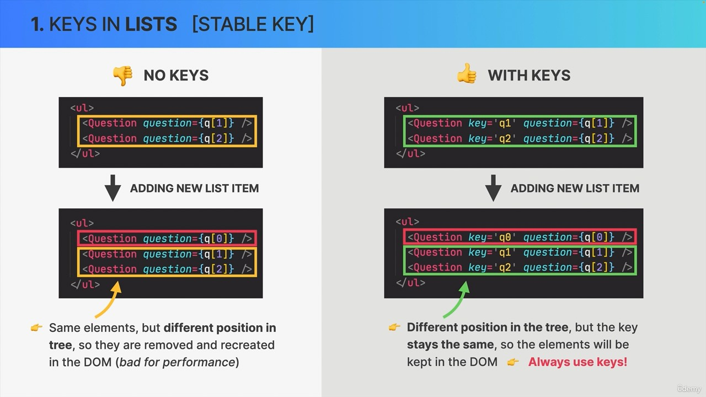
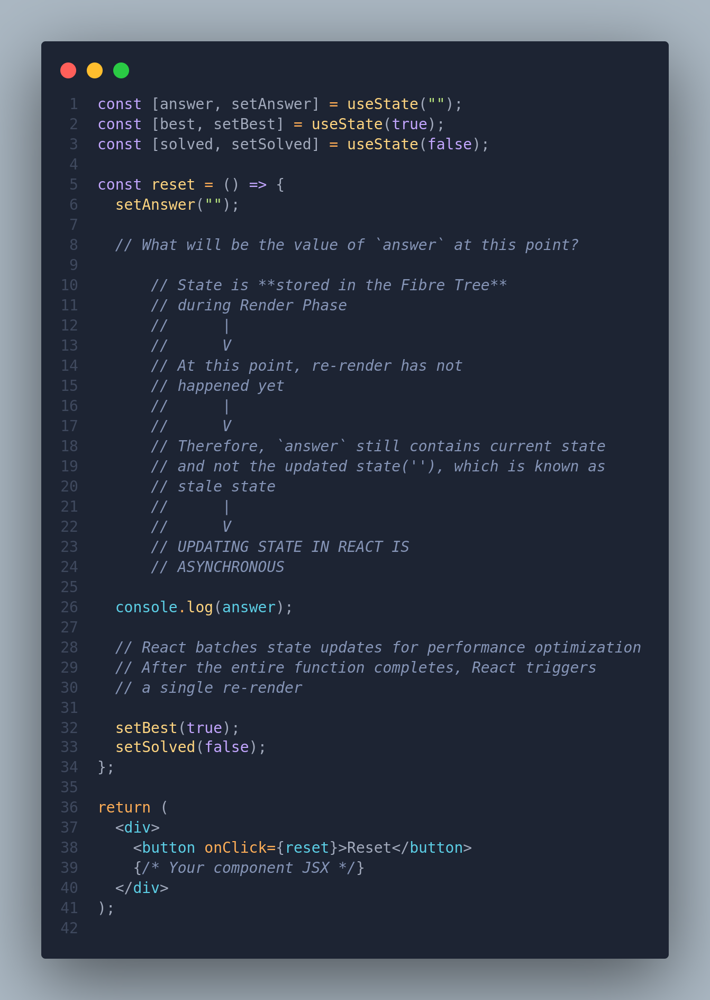
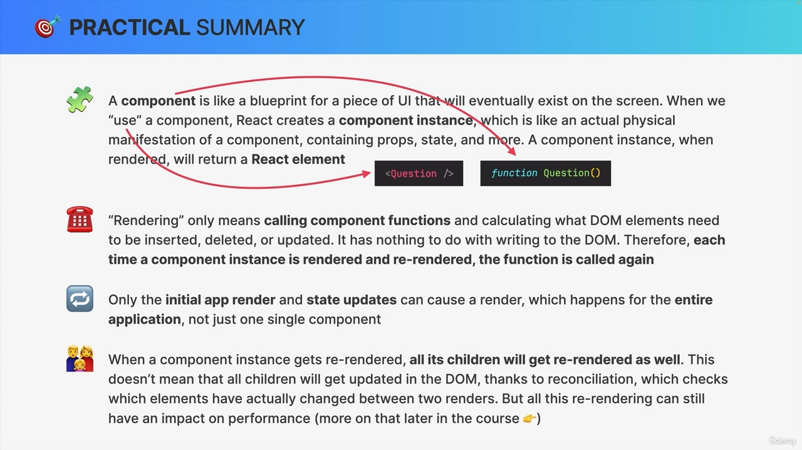
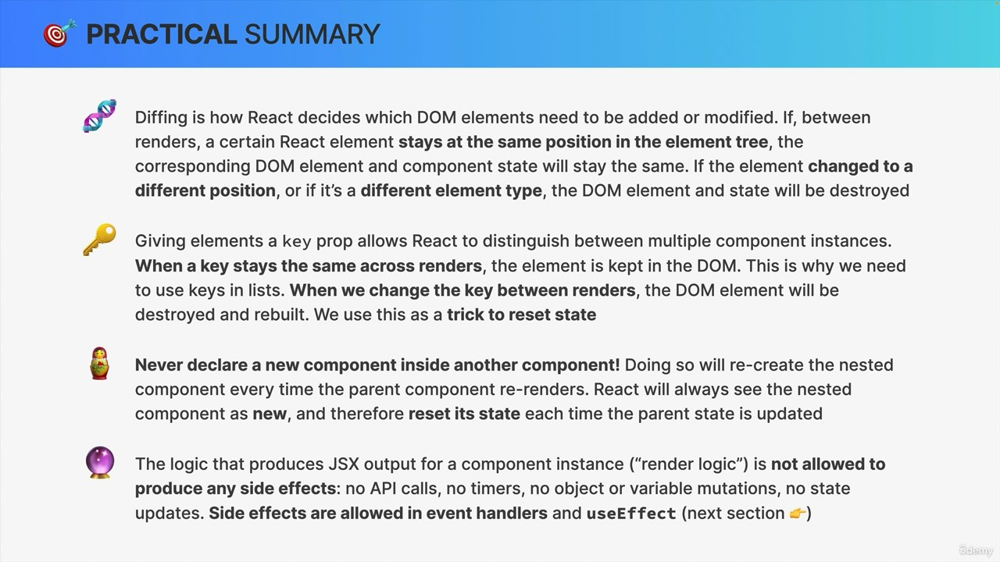
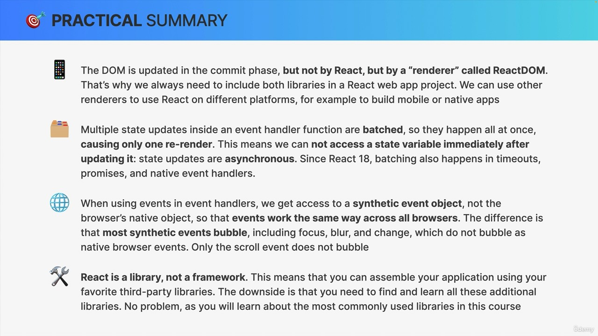

# How React Works behind Scenes?

## How Components are Displayed on the Screen ?

### Trigger is Rendered

- By updating `state` somewhere
- The two situations that triggers rendering:
  - Initial Render of the application
  - `state` is updated in one or more Component instances (re-render)
- The render process is triggered for the **entire application**
- Renders are not triggered immediately, but scheduled for when the JS engine has some 'free time' and this time is usually in milliseconds (ms). There is also batching of multiple setStates calls in event handlers (multiple `setState` calls in the function)

### Render Phase

- In React, rendering is not updating DOM or painting elements on the screen. Rendering only happens internally and doesn't produce any visual changes.

#### How Rendering Works &mdash; The Render Phase

- React will go through the entire component tree, take all the component instances that triggered the re-render and render them
  - Render essentially means calling corresponding component functions that triggered the re-render.
- Those renders will make the updated React Elements which altogether forms new Virtual DOM / React Element Tree.

##### Virtual DOM

- On the initial render, React will take the entire component tree and transform into one big React element tree and this is called Virtual DOM.
  - Tree of all React Elements created from all the instances of the component tree.
- It's cheap and fast to create multiple tree as its just a Javascript Object.
- Let's work on this React element tree

    ```mermaid
    graph TD
    A((A))
    B((B))
    C((C))
    D((D))
    E1((E1))
    E2((E2))

    A --> B
    A --> C
    A --> D
    D --> E1
    D --> E2
    ```

- Consider there's gonna a **`state` change in Component D** that will trigger the re-render. _**React will call the function of component D and place the new React element in a React Element Tree / New Virtual DOM**_.
  - **Rendering a component will cause all of its child components to be rendered as well (no matter if props changed or not)**. Rendering the component D will cause its child components E1 and E2 to be re-rendered as well in this scenario.
    - If the `state` in the root element changes (component A in this case), this will trigger re-render in the component itself along with all of its nested children as well, essentially re-rendering the whole application.

#### Reconciliation + Diffing

- New Virtual DOM that has been created after the `state` update, will get reconciled with the current fibre-tree as it exists before the `state` update. This reconciliation is done in React Reconciler called Fiber.
  - The result of this reconciliation process is gonna be a updated fiber tree which will be used to write to DOM.

##### Reconciliation

- React tries to be as efficient and reuses the existing DOM as much as possible and this is done via reconciliation.
  - **Deciding which DOM elements needs to be updated, inserted or deleted, in order to reflect latest changes is reconciliation**. _**Its like the heart of the React**_

##### Diffing

- Comparing elements based on their position in the Virtual DOM / React Element Tree in a render is known as diffing.

###### Diffing Rules

- Diffing uses 2 fundamental assumptions(rules):
  - Two elements of different types will **produce different trees**
    - Same Position, **Different** Element
      - React assumes **entire sub-tree is no longer valid**
      - Old components are destroyed and removed from the DOM, **including `state`**
      - Tree might rebuilt if children stayed the same (`state` is reset)
    - Same Position, **Same** Element
      - If after a render, an element at a certain position in the tree is the same as before, the element will be kept in the DOM, **including the `state`**
        - Sometimes, this is not what we want...Then we **use the key prop** &mdash; [learn-about-key-prop-here](./React%20Props.md#key-prop)
      - New props / attributes are passed if they changed between renders.
  - Elements with **stable key stays the same across renders**
    - When a **key stays the same across renders**, the element will be kept in the DOM (even if the position in the tree changes)
      - **Common Use Case: Assigning keys to elements in a list within a map function.**
      
    - When a **key changes between renders**, the element will be destroyed and a new one will be created (even if position in the tree remains same)
      - **Common Use Case: To reset `state` value**

### Commit Phase

- Render phase results in `list of effects` which are then written to the DOM in this phase. Committing phase is synchronous.

- React actually writes to DOM, updating, inserting and deleting elements.
- It's this phase that's traditionally refer to as Render phase and not the actual render phase

#### Rendering in React involves both the Render Phase and the Commit Phase and not only Render Phase

### Browser Paint

- Then the browser notices that the DOM has been modified and then it paints the contents.

## Understanding React Render Logic

### Types of Logic In React Components

#### Render Logic

- Code that lives at the **top** of the component function
- Participates in **describing** how the component view looks like
- Executed **every time** the component renders

#### Event Handler Logic

- **Executed as a consequence of the event** that the handler is listening for (onChange, onClick)
- Code that **actually does something**: update `state`, perform an HTTP request, read an input field, navigate to another page etc...

### Functional Programming Principles

#### Side effect

- Dependency on or modification of data outside the function scope &mdash; **interaction with the outside world**
  - Examples include mutating external variables, HTTP requests, writing to DOM
- Side effects are not bad as a program can be useful only when it has some useful interactions with the outside world.

#### Pure vs Impure Functions

- A function that has no side-effects
- Doesn't change any variable outside its scope
- Given the same input, a pure function always returns the same output
  - Calculating `circleArea()` is a pure function
  - Getting `Date.now()` from a function will be an impure function, as its output is unpredictable

### Rules for Render Logic

- **Components must be pure when it comes to render logic**: Should return the same JSX as output on inputting same props.
- **A render logic must produce no side effect**: no interaction with the outside world is allowed.
  - Do not perform **network requests** (API calls)
    - Side effects are allowed and encouraged in event handler functions. There's also a special hook to register side effects (useEffect) &mdash; [learn-about-useEffect-here](./React%20Use%20Effect.md)
  - Do not directly use the **DOM API**
  - Do not start **timers**
  - Do not **mutate objects or variable** outside the function scope &mdash; this is why we can't mutate props

## `state` Update Batching

- `state` batching is a concept in React where multiple ``setState`` calls are grouped together and applied in a single update to the component.
- **Just one Render and Commit per Event handler**.
- React batches `state` updates for performance reasons and ensures that multiple `state` updates within the same synchronous block of code are processed together, leading to a more efficient rendering process.

  

- In this example, when the `reset` function is called in response to the button click, there will be multiple ``setState`` calls:

  ```jsx
  const reset = () => {
    setAnswer("");
    console.log(answer);
    setBest(true);
    setSolved(false);
  };
  ```

Here's how `state` batching works in this scenario:

1. **Multiple `state` Updates:**
   - When `reset` is called, you have three ``setState`` calls (`setAnswer`, `setBest`, `setSolved`).

2. **Console Log:**
   - It's important to note that ``setState`` calls are asynchronous. The `console.log` statement will not immediately reflect the updated `state` because React has not yet applied the `state` changes.
     - Updated `state` variables are **not** immediately available after `setState` call, but only after the re-render.
     - This also applies when **only one** `state` variable is updated.
     - If we need to update state **based on previous update**, we use `setState` with callback (`setAnswer(answer => ...logic)`)

3. **`state` Batching:**
   - React will batch these `state` updates together for performance optimization.
   - This means that React will ensure that the component is not re-rendered multiple times for each `state` update but rather once after all the `state` updates are applied.

4. **Rendering:**
   - After the entire function (`reset` in this case) has completed, React will batch the `state` updates and trigger a single re-render of the component.

## Practical Summary

### 

---

### 

---

### 
