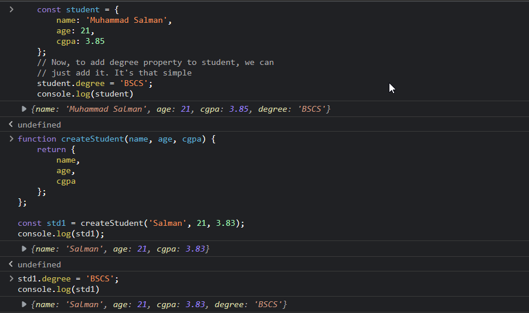

# Resources to Look for Guidance

- [JavaScript.Info](https://javascript.info/)
- [MDN](https://developer.mozilla.org/en-US/docs/web/javascript/)

## Variables

- Variables are created using `let` keyword after `es6` and datatype of any variable can be found out using `typeof` reserved word like this `typeof name`

    ```js
        let name = 'Salman' // String literal
        let profitRate = 5.6 // Number literal
        let age = 21 // Number literal
        let isPassed = true // Boolean literal
        let selectedColor = null // clear the value of variable
    ```

## Constant

- Constants in js are declared using `const` keyword

```js
    const interestRate = 4.5
```

## Objects - Also Dynamic as JS Variables and Arrays are

- Collection of key-value pair, properties that're highly related are encapsulated into objects
- Grouping related variables

    ```js
        let person = {
            name: 'Salman',
            age: 20
        };
    ```

- Accessing person object's attributes

  - Dot Notation

    ```js
        person.name = 'Muhammad Salman'
        console.log(person.name) // prints 'Muhammad Salman' on console
    ```

  - Brackets Notation, better for accessing properties on run-time means we can assign variable to it like

    ```js
        let selectedProperty = 'someSelectedProperty';
        console.log(person[selectedProperty]);
        
        person['name'] = 'Shehryar Salman'
        console.log(person['name']) // prints 'Shehryar Salman' on console
        
    ```

- ### Elaboration

    ```js
        // Object Literal syntax for Object Creation
        const circle = {
            radius: 1,
            location: {
                x: 1,
                y: 1
            },
            isVisible: true,
            draw: function(){
                console.log('Circle Drawn');
            }
        };

        // Method: A function associated with an object
        // Function: Standalone block of reusable code
        circle.draw(); // Method
    ```

- ### Factory Functions - For Object Creation with CamelCase Notation

  - Commonly used to create and return objects.

    ```js
    // Factory Function to create Circle
    function circleFactory(radius, location = 
    { x: 1, y: 1 }, isVisible) {
      return {
        radius,
        location,
        isVisible,
        draw() {
          console.log('Circle Drawn');
        }
      };
    }
    
    const circle1 = circleFactory(10, true);
    console.log(circle1.radius)
    circle1.draw()
    ```

- ### Constructor Functions - For Object Creation with Pascal Notation

  - ```js
        // Constructor Function for Circle
        function Circle(radius, location = {x: 1, y: 1}, isVisible){
            this.radius = radius,
            this.location = location,
            this.isVisible = isVisible
            this.draw = draw(){
            console.log('Circle Created');
            }
        }
            
        const newCircle = new Circle(20, true);
        newCircle.draw();
    ```

- ### Dynamic Nature of JS Objects

  - We can add or delete objects properties

    ```js
    const student = {
        name: 'Muhammad Salman',
        age: 21,
        cgpa: 3.85
    };
    // Now, to add degree property to student, we can
    // just add it. It's that simple
    student.degree = 'BSCS';
    console.log(student)
    ```



- ### Constructor Property

  - References the constructor used to construct that very specific object

    ```js
        let vehicle = {};
        // Behind the doors
        // let vehicle = new Object();
        
        // Prints ƒ Object() { [native code] }
        vehicle.constructor; 
        new String(); // '', "", ``
        new Boolean(); // true, false
        new Number(); // 1, 2, 3, ...
    ```

- ### Functions are Objects

- ### Value Types vs Reference Types

- Primitives are copied by their values, whereas Objects are copied by their references.

```js
 // Pass by value example
 let num = 10;
 function increment(num){
  num++;
 }
 increment(num);
 // Prints 10 on console as both variables are independent
 console.log(num); 

 // Pass by reference example
 let obj = {value: 10};
 function increment(obj){
  obj.value++;
 }
 increment(obj);
 // Prints 11 on console as obj reference is passed
 console.log(obj); 

```

<center>

| **Value Types** | **Reference Types / Objects** |
|-----------------|---------------------|
| Number          | Object              |
| String          | Function            |
| Boolean         | Array               |
| Symbol          |
| undefined       |
| null            |

</center>

- ### Enumerating the properties of Object

  - Objects are not iterable

- ### Clonning an Object

    ```js
    const circle = {
    radius: 1,
    draw(){
    console.log('Circle drawn');
    }
    };
    
    // Method 1: Brute force / Older Way
    const another = {};
    for(let key in circle)
    another[key] = circle[key]
    console.log(another) // prints the circle object to console
    
    // Method 2: Using Object.assign
    // It's a powerful way, can clone object with existing
    // properties or can be clonned to an empty object
    // There can be multiple sources to clone into destination
    const yetAnother = Object.assign({ 
    color: ["red", "green"]
    }, circle)
    console.log(yetAnother);
    
    // Method 3: Using spread operator
    const yetYetAnother = { ...circle }
    console.log(yetYetAnother)
    
    // Another demonstration fo Spread Operator
    const yetYetAnother = { ...circle, ...yetAnother }
    console.log(yetYetAnother)

    ```

- ### Garbage Collection - Works same like JAVA

- ### MATH - Same as JAVA

- ### STRING - Same as JAVA

- ### Template Literals

    ```js
    // Starts with backtick ``, unlike quotes '', ""
    const name = 'Shehryar'
    const message = `Hi ${name}
    Thanks for joining my mailing list.
    
    Regards,
    Salman
    `
    
    // Outputs the message as we typed in our code
    
    ```

- ### Date - Same as JAVA

- ### Object Equality - Same as JAVA

## Arrays → Object

- Array literals have following syntax in the js and follows the same indexing principles like java, e.g. index starts from 0
- JS Arrays like the JS variables are also dynamic (both array length and object datatype), we store data of different datatypes in same JS Array

```js
     let stdMarks = [12, 38, 48, 34, 22];
     console.log(stdMarks[1]) // prints 38 on console
     stdMarks[5] = 29;
     stdMarks[1] = 'Thirty Eight'
     console.log(stdMarks[1])
     // Result
      (6) [12, 'Thirty Eight', 48, 34, 22, 29]
        0: 12
        1: "Thirty Eight"
        2: 48
        3: 34
        4: 22
        5: 29
        length: 6
        
```

- ### Adding elements to Array

```js
 const numbers = [2, 3]
 
 // End
 numbers.push(4, 5)
 // Beginning
 numbers.unshift(1, 2)
 // Middle
 numbers.splice(2, 0, 'a', 'b', c)
 
 console.log(numbers) 
```

- ### Finding Elements in Array

- Predicate - A function passed as an argument to another function. In the given example, a predicate function is passed as an argument to the `find` method.
- Callbacks - Predicates are referred to as callbacks because they are called back by the function they are passed to. In the example, the predicate function is called on every iteration by the `find` method
- Find method stops on first matching criteria

    ```js
    // Primitive Types
    const std_id = [1, 2, 3, 4, 1];
    
    console.log(std_id.indexOf(1))
    
    console.log(std_id.lastIndexOf(1))
    
    console.log(std_id.includes(4))

    console.log(std_id.includes(4)?'Number Found' : "Doesn't Exist")
    
    // Reference Types
    // Same thing for findIndex()
    const courses = [
    {id: 1, name: 'OS'},
    {id: 2, name: 'Numerical Analysis'},
    {id: 3, name: 'Differential Equation'}
    ];
    const course = courses.find(function(course){
    return course.name === 'Numerical Analysis'
    } 
    );

    console.log(course)

    ```

- ### Arrow Functions

- We can use short hand notation of callback or predicate function for more clarity and cleaner code.
  - Remove the ~~function~~ keyword
  
    ```js
    const course = courses.find((course){
        return course.name === 'Numerical Analysis'
    });
    ```

- Seprate the parameters from its body, we use fat-arrow `=>`
  - Multiple parameters are seprated using commas `,`

    ```js
        const course = courses.find((course)=>{
            return course.name === 'Numerical Analysis'
        });    
    ```

  - Now, if we've just one parameter and is returning a value, we can remove the brackets around that parameter and return keyword to remove nuisance
   
    ```js
    const course = courses.find(course => course.name === 'Numerical Analysis');
    ```

  - If we've no parameters, we've to pass empty brackets `()`
  
    ```js
    const course = courses.find(()=> {
        return course.name === 'Numerical Analysis'
    });
    ```

- ### Removing Elements from Array

 ```js
        const num = [1, 2, 3, 4, 5]
        
        // End
        const end = num.pop()
        console.log(`Removed Element: ${end} Remaining Array: ${num}`)
        
        // Beginning
        const start = num.shift()
        console.log(`Removed Element: ${start} Remaining Array: ${num}`)

        // Somewhere in Middle
        const middle = num.splice(2, 2)
        console.log(`Removed Element: ${middle} Remaining Array: ${num}`)  
 ```

- ### Emptying an Array

  - Reassign the array with a new empty array
  
 ```js
  let num = [1, 2]
  num = []
  console.log(num) // prints []
 ```

- Set the array length to 0  `num.length = 0`
  - We can use splice as well as pop() and other element removing methods in loop to empty the array

    ```js
    num.splice(0, num.length) // empties the array
    while(num.length > 0)
        num.pop()
    ```

- ### Combining and Slicing Arrays

  - We can use `concat()`  to combine arrays and `slice()` for slicing arrays
  - We can use `slice()` for copying primitive values also
  - For primitive values, copy by value happens and for objects or reference types copy by reference happens in both the cases.

    ```js
    const num1 = [1, 2, 3]
    const num2 = [4, 5, 6]
    const num3 = num1.concat(num2)
    console.log(num3)
    
    const num4 = num2.slice() // copies num2 to num4
    ```

### Spread Operator

- ### Reducing an Array

  - Arrays have reduce() method, which reduces all the elements of  array to a single value
    - Value can be a number, a string. It can be anything

        ```js
        const itemPrices = [12, 34, 56, 23, 10]
        const total = itemPrices.reduce((accumulator, currentValue) => {
        accumulator + currentValue
        }, 0)
        console.log(total)
        
        // A more neat and elegant way
        // 2nd argument is 0 as its the value of accumulator
        const itemPrices = [12, 34, 56, 23, 10]
        const total = itemPrices.reduce((accumulator, currentValue) => accumulator + currentValue, 0)
        console.log(total)
        
        // If we don't pass the initial value, one call will be reduces
        // as the method sets the first value as its initial value
        // and the second value as current value
        ```

## Functions

```js
    function simple_greeting(fName, lName){
        console.log('Hello ' + fName + ' ' + lName)
    }

    // Another concise way of embeding expressions or variables
    // within a string literal interpolation, describe below
    
    function greet_interpolation(fName, lName) {
        console.log(`Hello ${fName} ${lName}`);
    }

    greet_interpolation('Muhammad', 'Salman');

    
    function sum(num1, num2){
        console.log(num1 + num2)
    }
    sum(21, 50) // prints 71 to console
    
    // 21 and 50 are arguments to parameter of sum functions
        // argument: supplied value to function call
        // parameter: declared in function structure
        
    // we can also have default parameter value in JS Functions
    // If user doesn't provides argument to that parameter,
    // then default value would be used
    
    function sum(num1, num2, num3 = 12){
        console.log(num1 + num2 + num3)
    }
    sum(21, 50) // prints 83 to console
    
    // performing a calculation
    
    function square(number){
        return number * number
    }
    
    console.log(square(3))
```

- ### Function Declaration

  - Functions are objects in JS, so we can assign them to variable
  - Two ways of declaring function in JS
    - Function Declaration
    - Function Expression
      - Anonymous
      - Named

        ```js
        // Function Declaration
        function walk(){
            console.log('walk');
        }
        
        // Anonymous Function Expression
        let run = function(){
            console.log('run');
        }
        // Named Function Expression
        let run = function run(){
            console.log('run')
        }
        
        let move = run
        move()
        run()
        ```

- ### Hoisting

  - It is a process of moving function declarations to the top of file and is done automatically by the JS engine.
  - We can call a function before its declaration, but can't call a function that's declared using function expression before its declaration

    ```js
    // works like charm
    walk()  
    function walk(){
    // some statements here...
    }
    
    // gives error
    run()
    let run = function(){
    // Again some statements here...
    }
    ```

- ### Arguments

  - We can pass as many arguments as we want in js, there's no limitation on it
  - Every function in JS has special object `arguments`
  - We can also pass or set default value of parameters.
    - They'll be used when the function call doesn't specify that specific argument

        ```js
        function sum(){
        let total = 0
        for(let num of arguments)
            total += num
        console.log(total)
        }
        
        sum(1, 2, 3, 4, 5)
        ```

- ### The REST Operator

  - For passing varying number of parameters to a function, in modern JavaScript we use REST Operator
    - Looks exactly the same like SPREAD operator

        ```js
        // ...args returns a real array not an object, as
        // was the case with arguments object 
        function sum(...args){
            console.log(args)
            let total = 0;
            for(let num of args)
            total += num
            console.log(total)
        }
        
        // Much More concise code
        function sum(...args){
            const total = args.reduce((a,b) => a+b)
                console.log(total)
        }
        sum(1, 30, 40, 70, 90, 23, 90)
        sum(23, 54, 67, 43)  
        ```

- ### Default Parameters

  - We can use default params in case a user doesn't provides a value for one.

    ```js
        function sum(x = 0, y = 0){
            return x + y;
        }

        console.log(sum(x+y));  //prints 0
        console.log(sum(10, 20));   //prints 30
    ```

- ### Let vs Var

  - Var scope is function-scoped and not limited to the block where it was declared as is the case with let.
  - If var is not declared in a function, then it's of global scope and is attached to windows object of the browser
    - can cause issue in our app, if some third party also using that same variable and it can override our variable
  - var => function-scoped(if declared in a function), otherwise global
  - ES6(ES2015) : let => block-scoped

## Operators

- ### Arithmetic

  - Used for Mathematical calculations

    ```js
        let x = 20
        let y = 10
        console.log(x + y) // prints 30
        console.log(x - y) // prints 10
        console.log(x * y) // prints 200
        console.log(x / y) // prints 2
        console.log(x % y) // prints 0
    
            // Exponentiation operator, x to the power y
            // This operator raises the value of x to the power of y.
    
        console.log(x ** y) // prints 10240000000000
    
        // Increment Operator(++x or x++)
        console.log(++x) // first increments the value then prints
        console.log(x++) // first prints then increments the value
        // Decrement Operator works in similar fashion
    ```

- ### Assignment

  - `=` is the default assignment operator and like in java we can also assigns the value of an expression in concise fashion like this,

    ```js
    let x = 3 // default
        
    x = x + 10 // this and the below line expression are equivalent
    x += 10  // Both of them process the same logic
        
    x = x * 10
    x *= 10
        
    // All other arithmetic operators work in similar way
    ```

- ### Comparison Operator

  - The result of an expression involving a comparison operator evalutes to Boolean

    ```js
        let x = 10
        console.log(x < 20) // prints true
    
        // Relational Operators
        console.log(x < 20) // evalutes true
        console.log(x <= 20) // evalutes true
        console.log(x > 20) // evalutes false
        console.log(x >= 20) // evalutes false
        // Equality Operators
        console.log(x === 10) // evalutes true
        console.log(x !== 10 ) // evalutes false
    
            // We've two types of Equality operators
    
        // Strictly Equality (Type + Value)
        console.log(1 === 1) // evalutes true
        console.log('1' === 1) // evalutes false (type mismatch)

        // Losely Equality, doesn't care about type and
        // only checks the value. It converts the right side
        // to the left side type and then performs comparision
        console.log(1 == 1) //evalutes true
        console.log('1' == 1) //evalutes true
        console.log(true == 1) // evalutes true
        console.log(false == 0) // evalutes true
    ```

- ### Ternary Operators

  - Often used as a shorthand for simple conditional statements

    - Conditional Assignment

        ```js
            let age = 25;
            let type = (age >= 18) ? "Adult" : "Minor";
        ```

    - Conditional rendering in UI

        ```js
            const isLoggedIn = true;
            const greeting = isLoggedIn ? "Welcome back!" : "Please log in.";
        
        ```

    - Inline conditionals

        ```js
            // A dynamic message based on the value of points, 
            // ensuring that the correct pluralization of "point"
            // is used when needed.
            let points = 100;
            let message = `You have ${points} point${points === 1 ? '' : 's'}.`;
        
        ```

    - Default or fallback values, also a good example of Short-circuiting

        ```js
            // If the username is falsy (e.g., an empty string), the
            // ternary operator will assign the fallback value 
            // "Anonymous" to the displayName variable.
            let username = "";
            let displayName = username || "Anonymous";
        ```

  - General Examples involving the use of ternary operator

    ```js
        // If the customer has more than 100 points, they're 
        // gold customer, otherwise silver
        let points = 110;
        let type = (condition goes here) ? <on true> : <on false>;
        let type = points > 100 ? 'gold' : 'silver'
        console.log(type) // prints gold
        
        // Another example of using ternary operators
        let age = 25;
        let type = (age >= 18) ? "Adult" : "Minor";
        console.log(type); // Output: "Adult"
    
    ```

- ### Logical Operators

```js
    // Logical AND(&&)
        // Returns TRUE only if both operands are TRUE
    // Logical OR(||)
        // Returns TRUE if any of the operand is TRUE
    // Logical NOT(!)
        // Returns the INVERTED value
    // falsy(False)
        // undefined
        // null
        // 0
        // '' or ""
        // false
        // NaN
    // Anything that's not falsy → Truthy
            'Salman' || false // evalutes to true
            '' || false // evalutes to false, as '' is a falsy
            1 || false // evalutes to true
            0 || false // evalutes to false

    // Short-circuiting - The output of this code will be 'Salman',
    // as it is the first truthy value encountered in the series of 
    // expressions. 
    // Subsequent operands are not evaluated because the 
    // overall result of the expression is already determined
        console.log(false || null || 'Salman' || 21 || undefined || 'BSCS');

        // This code outputs 'blue' as its the truthy value
        // If user has set the color (yellow) then that'll be our 
        // current color, not the default one due to short-circuiting
        let userColor = undefined
        let defaultColor = 'blue'
        let currentColor = userColor || defaultColor
        console.log(currentColor)
```

- ### Bitwise - Works on individual bits

```js
    // 1 = 0000001
    // 2 = 0000010
    // 3 = 0000011 which evalutes to 3 Bitwise OR
    // 0 = 0000000 which is Bitwise AND
    
    // Bitwise OR(|) - checks individual bit and applies
    // the logical OR to individual bit of both operands
    console.log(1 | 2);
    
    // Bitwise AND(&) - works in similar fashion
    console.log(1 & 2)
    
    // Acess Control System - Read, write and execute
    // 0000100 - 4 → 0000100 → Read
    // 0000010 - 2 → 0000110 → Read, Write
    // 0000001 - 1 → 0000111 → Read, Write and Execute
    
    const readPermission = 4;
    const writePermission = 2;
    const executePermission = 1;
    
    // With Bitwise OR we can add permissions
    // With Bitwise AND we can check permissions
    
    let myPermission = 0;
    myPermission = myPermission | readPermission | writePermission;
    
    let message = (myPermission & executePermission) ? 'yes' : 'no';
    
    // Prints 'You're not allowed to execute this file'
    console.log(message)
    
```

## Control Flow

### Conditional Statements

- #### if...else - Same like java

- #### switch...case - Same like java

### Loops

- #### for - same as java

- #### while - same as java

- #### do...while - same as java

- #### for...in - Iterate over properties of object or elements of an array

    ```js
        let person = {
            name: 'Salman',
            age: 21
        };
            // Recommended way to access object's properties at 
            // runtime is by using bracket's notation.
            // We can also use for...in to iterate over arrays
            // but again not recommended after ES6
        for(let key in person){
            console.log(key, ' → ' , person[key])
        }
    
            //Iterating over an array using for...in
        let colors = ['red', 'green', 'yellow', 'black'];
        for(let index in colors){
            console.log(index, ' → ', colors[index])
        }
    ```

- #### for...Of - Recommended way to iterate over arrays in ES6

```js
     let cities =  ['Hunza', 'Karachi', 'Lahore', 'Gujranwala'];
     for(let city of cities){
        console.log(city)
     }
```

### Break and Continue

- ### break → jumps out of the loop or exit the loop

- ### continue → moves to the next iteration of the loop or skip some iterations of the loop