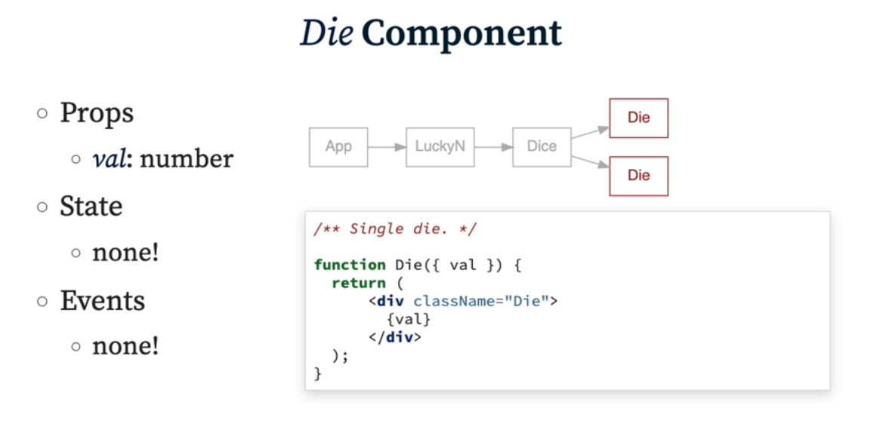
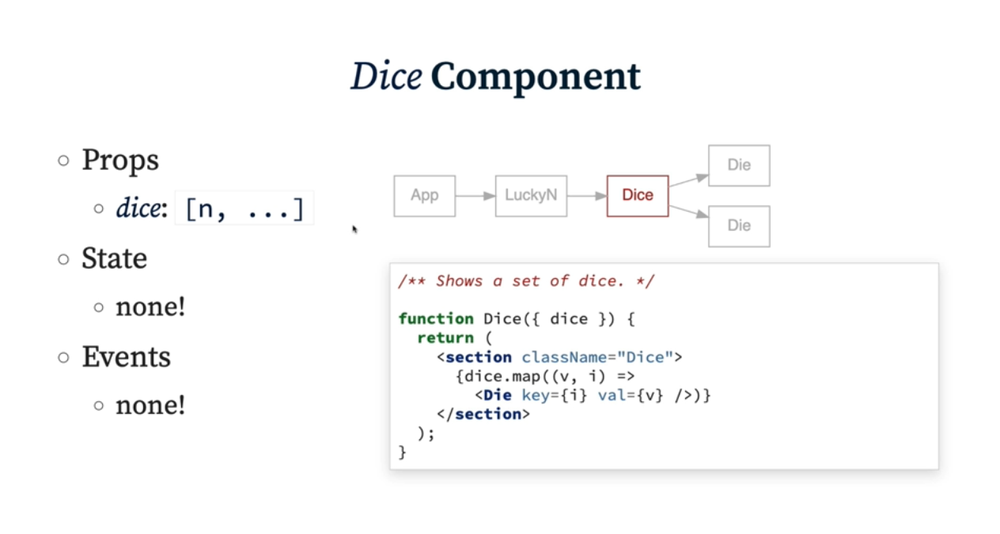

# React Component Types

- What props do we need ?
- What state do we need ?
- And where ?
  - State can't be passed upwards. Data is passed uni-directional from parents to child and not vice versa.

**Presentational / Stateless / Dumb Components** &mdash; Focus on rendering UI elements and receiving props. Doesn't have a state; is primarily about appearance/UI

**Logical / Stateful Components** &mdash; Responsible for managing state and handling business logic. Has state or related logic, isn't about a specific UI

## State Management

> **Lift the state as high as needed &mdash; but no higher.**
>
- Think about where the state will live?
  - In case of **LuckyN Dice** &mdash; (we roll dices and checks whether the sum of the rolls is equal to some goal or not), where should the state lie? In the LuckyN component or Dice Component which in turn is again parent to individual die components.

    - **App.jsx** &mdash; don't need it, so shouldn't put it.
    - **LuckyN.jsx** &mdash; this is the game itself (ideal)
    - **Dice.jsx** &mdash; should just be showing a hand
    - **Die.jsx** &mdash; render each die component onto screen, no need for state and also we need the sum of every Die not just of a single instance, so we should lift the state up.

### Building Die and Dice Components



---



### Passing State and Functions as Props

- A lot of the time, you'll have a state which is self-contained in the component(not being passed to another component), but also passing state down to child components is also common in React.
  - `LuckyN.jsx` has an array state named `dice` which is passed to `Dice.jsx` which then loops over and pass each array value to the `Die.jsx` as prop which it renders. Such pattern are extremely common in React.

Let's take a real-life example of a simple counter application where the counter value is stored in the state of the parent component and passed down to a child component as a prop.

  ```jsx
  import React, { useState } from 'react';

  // Parent Component
  const CounterApp = () => {
    const [count, setCount] = useState(0);

    const increment = () => {
      setCount((prevCount) => prevCount + 1);
    };

    const decrement = () => {
      setCount((prevCount) => prevCount - 1);
    };

    return (
      <div>
        <h1>Counter App</h1>
        <p>Count: {count}</p>
        {/*
          Passing functions down to child components
        */}
        <CounterControls count={count} onIncrement={increment} onDecrement={decrement} />
      </div>
    );
  };

  // Child Component
  const CounterControls = ({ count, onIncrement, onDecrement }) => {
    return (
      <div>
        // Setting the event handlers from props
        <button onClick={onIncrement}>Increment</button>
        <button onClick={onDecrement}>Decrement</button>
      </div>
    );
  };

  export default CounterApp;
  ```

In this example:

- The `CounterApp` component is the parent component that manages the state (`count`) using the `useState` hook.
- The state value (`count`) is passed down to the `CounterControls` component as a prop.
- The `CounterControls` component receives the state as a prop and also receives functions (`onIncrement` and `onDecrement`) as props to update the state in the parent component when buttons are clicked.

This way, the state is lifted to the parent component, and its values are passed down to child components as needed.

**Summary:**

- Parent components define functions.
- These functions are passed as props to child components.
- Child components can then invoke these functions.

### Passing Functions that Update State

A common use case for passing functions as props is to allow child components to update the state of the parent.

- Example:

    ```jsx
    // Parent Component
    const ParentComponent = () => {
      const [count, setCount] = useState(0);

      const updateCount = (newCount) => {
        setCount(newCount);
      };

      return <ChildComponent updateCount={updateCount} />;
    };

    // Child Component
    const ChildComponent = ({ updateCount }) => {
      return (
        <button onClick={() => updateCount((prevCount) => prevCount + 1)}>
          Increment Count
        </button>
      );
    };
    ```
