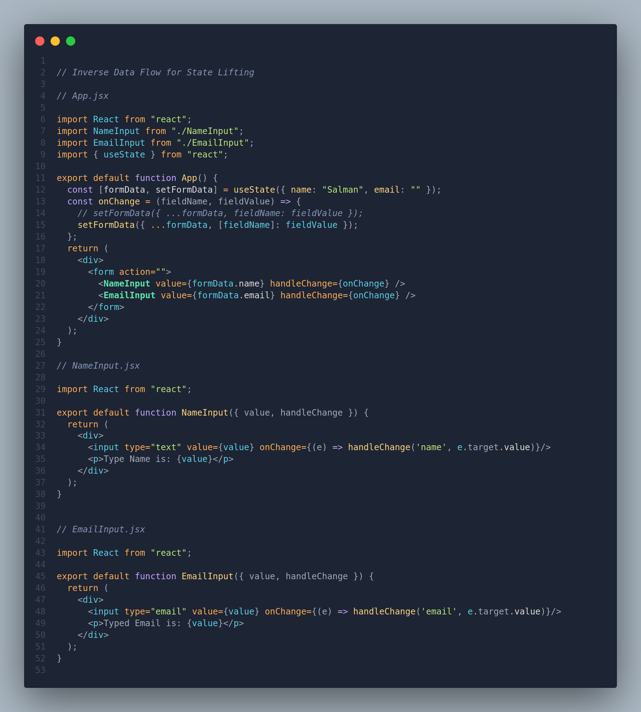

# State Management

Understanding the difference between local and global states, as well as when and where to create state, is essential for making informed decisions in your React components.

## Local vs Global States

- **Local states** are encapsulated within a component and can be passed down to children or sibling components.
- **Global/Shared states** are shared among multiple components, such as in scenarios where data needs to be displayed across various parts of the application. Examples include order summary pages, cart sections, and user account pages. To handle global states, you can use the `Context API` or a state management library like `Redux`.

### When to Create State: Checklist

**Always start with local variables**. Use the following checklist to determine when to create state in your components:

1. **Does the Data Change?**
   - **No:** Use regular `const` or `let` variables.
   - **Yes:**
     - **Can it be Computed via Existing State/Props?**
       - **Yes:** Consider using **Derived State** (not always applicable).
       - **No:**
         - **Should it Re-render the Component?**
           - **No:** Use the `useRef` hook.
           - **Yes:** Place the data inside the `useState` hook.

### Where to Place State

- **Only Used by the Component:**
  - **Yes:** Leave it in the component.
  - **No:**
    - **Need in the Child Component:**
      - **Yes:** Pass it via props.
    - **No:**
      - **Need in One or More Sibling Components:**
        - **Yes:** Lift the state up to a common parent component.

### Derived State

Derived state in React refers to state values that are calculated or derived from existing state or props. It's a technique to simplify state management and ensure that related pieces of state stay in sync without unnecessary complexity.

#### Example: Shopping Cart

Consider a shopping cart application with three pieces of state:

```jsx
const [cart, setCart] = useState([]); // The main state representing the items in the cart
const [numItems, setNumItems] = useState(0); // Derived state for the number of items in the cart
const [totalPrice, setTotalPrice] = useState(0); // Derived state for the total price of items in the cart
```

#### The Problem

- Updating `cart`, `numItems`, and `totalPrice` separately can lead to synchronization issues and unnecessary re-renders.

#### The Solution

- Define the properties `numItems` and `totalPrice` within the `updateItem` function and assign values to them by calculating the derived values based on the necessary data.

    ```jsx
    // Function to update the cart and calculate derived properties
    const updateCart = (newCart) => {
    // Calculate numItems and totalPrice based on the current cart
    const numItems = newCart.length;
    const totalPrice = newCart.reduce((total, item) => total + item.price, 0);

    // Update the cart with derived properties
    setCart([...newCart], numItems, totalPrice);
    };
    ```

#### Benefits

1. **Synchronization:** No need to manually keep `numItems` and `totalPrice` in sync with `cart`.

2. **Performance:** Avoid unnecessary re-renders by updating derived state only when the main state (`cart`) changes.

## Inverse Data Flow

In React, data typically flows downward from parent components to child components through props. However, there are scenarios where **data needs to be updated in a parent component based on actions or events that occur in a child component**. This concept is known as **Inverse Data Flow**.

### Use Cases

#### Child to Parent Communication

- When a child component needs to **inform its parent about a particular event or state change**, such as a button click or user input.
- Common patterns for achieving this include:
  - **`Callback functions`**: Pass a function from the parent as a prop to the child, and the child calls this function to communicate with the parent.
  - **`State lifting`**: Lift the state to a common ancestor, allowing multiple children to share and update the same state.

#### Context API

- In cases where data needs to be shared across components that are not directly connected in the component tree.
  - The **_Context API_** in React provides a way to share values like a state or callback functions between components without passing them explicitly through props.

### Implemented Code



#### Explanation

- The `App` component maintains the state (`formData`) for both name and email.
- It passes down the state and a function (`onChange`) to update the state to `NameInput` and `EmailInput` components.
- `NameInput` and `EmailInput` components receive the state and the function as props and update the state when the input fields change.

The key is in the `onChange` function, which dynamically updates the corresponding field in the state based on the field name provided. This is an example of inverse data flow where child components can influence the state of the parent component.

**`On line 14`**, the code won't work because `fieldName` will be treated as a literal string, not as a variable. To dynamically set a property in an object using a variable as the key, use `[fieldName]` instead of `fieldName`. This ensures the variable's value is used as the key.
