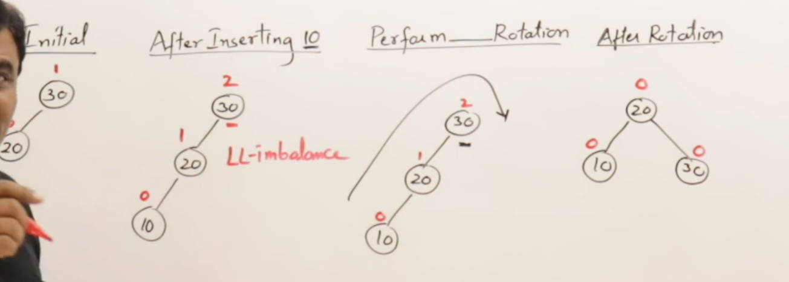

# AVL Trees
### 1. AVL Trees are height balanced binary search trees.
### 2. Balanced Factor
-	balance factor = height of left-subtree - height of right-subtree
	## -	hf = hl - hr = Valid Values{-1, 0, 1}
	## -	if |hf| = |hl - hr| <= 1	balanced
	## -	if |hf| = |hl - hr| > 1	imbalanced
### 3. Calaculate Balance Factor
-	Don't count the nodes
-	Count the levels / height 
### 4. Balance BST by Rotation
### Rotations are always done on 3 nodes.
#### 1. LL-Rotation

#### 2. RR-Rotation
#### 3. LR-Rotation
#### 4. RL-Rotation
