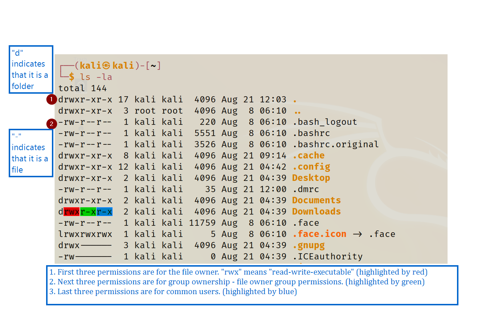

## 1. tmp folder Permissions 
- Upon the creation of file, following permissions are given
	- ==**-rw-r--r--**==
	- ==Owner doesn't have the execution permissions by default==
-	==**/tmp/ folder has the rights to read-write-execute for all the users.**==
	-	It is commonly used to upload exploits and then execute them from /tmp/ folder

## 2. General Overview
- Following image will give us better picture of Linux file permissions.
    
	
	# 3. Edit File Permissions
	## 3.1 ==chmod - change mode==
	- **chmod +x** - gives us the execution permissions
	- **chmod +rwx** - gives us the full read-write-execute control
	## 3.2 ==Number Feature for Permissions==
	- ==**chmod 777**== - gives full permission across the board including owner, owner group members and all other users have **r-w-x** access to this specific file